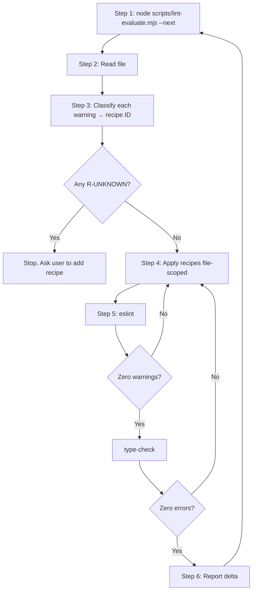

# Lint Reduction Loop

A repeatable loop that turns lint warning reduction into a mechanical exercise.
The orchestrator (or a cheap delegate) iterates one file at a time, applies a
**named recipe** for each warning rule, and refuses to advance until the
**verification gate** for that file passes.

The recipe library lives at
[`.ai/instructions/lint-strong-typing-recipes.md`](../../../.ai/instructions/lint-strong-typing-recipes.md).
Read it once before starting; refer to recipes by ID (e.g. `R-PRISMA-MOCK`)
when patching.

---

## ⚠️ HARD CONSTRAINTS — read before Step 1

These exist because they are the exact shortcuts an agent under cost pressure
will rationalize taking. Every one of these is **non-negotiable**:

| ✅ Allowed                                      | ❌ FORBIDDEN — hard stop                              |
| ----------------------------------------------- | ----------------------------------------------------- |
| Strong types from `@prisma/client` (`Prisma.*`) | `// eslint-disable-next-line` anywhere                |
| Local fixture factories                         | `// @ts-expect-error` / `// @ts-ignore`               |
| `vi.mocked(fn)`                                 | `(fn as any)` to access mock methods                  |
| Narrow `unknown` cast helpers (e.g. `asMock`)   | `as any` cast on a value                              |
| `as never` on Prisma deep-mock returns          | Widening a parameter type to silence lint             |
| `Decimal` from `@prisma/client/runtime/library` | `{ toNumber: () => x } as any` to fake a Decimal      |
| Adding a missing field to a fixture             | Editing `eslint.config.*` or `tsconfig.json` to relax |
| Removing a genuinely unused import              | Renaming a used variable to `_x` to dodge `no-unused` |

**Anti-rationalization patterns** — if you catch yourself thinking any of
these, STOP and re-read the recipe library:

- "I'll just `as any` this one — it's a test file." → **No.** Use `R-PRISMA-MOCK` or `R-VI-MOCKED`.
- "The Prisma payload type is too verbose, `any` is clearer." → **No.** Use `R-PRISMA-PAYLOAD`.
- "I'll disable the rule for the whole file." → **No.** That is a global behaviour change.
- "I'll widen the function signature to `unknown` so it accepts the mock." → **No.** Narrow the mock, not the API.
- "I'll skip `type-check` this iteration to save time." → **No.** It is a mandatory gate.
- "I'll fix unrelated warnings in nearby files while I'm here." → **No.** File-scoped only.

If a warning has **no matching recipe**, do not invent a workaround. Stop and
ask the user to add a new recipe to the library. New recipes only enter the
loop via the user.

---

## Step 1 — Pick the target file

Run the evaluator to discover the next highest-warning file:

```bash
node scripts/lint-evaluate.mjs --next
```

This prints:

- the file path
- every warning (line, column, rule, message)
- a **recipe hint** for each warning (e.g. `R-PRISMA-MOCK`, `R-UNUSED-VAR`)

If the user passed `--file <path>`, target that file instead of the
script-picked one.

---

## Step 2 — Read the file in full

Read the entire target file once. Read **only** the file's direct
collaborators when a recipe explicitly requires it (Prisma schema for a model
shape, a service signature for a return type, a tRPC router context shape).

Never read sibling files "just in case". The loop is file-scoped.

---

## Step 3 — Classify each warning

For every warning, write down (mentally or in scratch) the recipe ID:

| Rule / Symptom                                  | Recipe ID               |
| ----------------------------------------------- | ----------------------- | --- | ----------------------------- | ----------------------- |
| `(prisma.X.method as any).mockResolvedValue(…)` | `R-VI-MOCKED`           |
| Test fixture object `… as any` for Prisma model | `R-PRISMA-MOCK`         |
| Hand-rolled subset of a Prisma row              | `R-PRISMA-PAYLOAD`      |
| `vi.mocked(auth).mockResolvedValue(…)` mismatch | `R-AUTH-MOCK-HELPER`    |
| tRPC `createCaller({…} as any)`                 | `R-TRPC-CALLER-CONTEXT` |
| `{ toNumber: () => N } as any`                  | `R-DECIMAL-LITERAL`     |
| `mock.calls[0][0] as any`                       | `R-MOCK-CALL-ARGS`      |
| React mock component prop typed as `any`        | `R-COMPONENT-PROPS`     |
| `catch (e: any)` / `error as any`               | `R-UNKNOWN-ERROR`       |
| Unused import / param / variable                | `R-UNUSED-VAR`          |     | `react-hooks/exhaustive-deps` | `R-HOOK-DEPS`           |
| `react-hooks/rules-of-hooks` on a `use*` param  | `R-HOOK-RULES`          |     | Anything else                 | `R-UNKNOWN` → STOP, ask |

If any warning maps to `R-UNKNOWN`, stop and ask the user before patching.

---

## Step 4 — Apply patches (one file only)

Apply each warning's recipe transformation. Constraints:

- **One file per iteration.** Do not touch any other file unless a recipe
  explicitly requires it (e.g. add a field to a shared factory).
- **No global formatters.** Do not run `prettier --write`, `eslint --fix`,
  `vitest --update`.
- **Minimal diff.** Keep behaviour unchanged. No refactors disguised as type
  fixes.
- **No new comments** explaining the type change. The code change is its own
  documentation; commit message explains the why.

---

## Step 5 — Verification gate (mandatory)

The file is **not done** until all three return clean. Run them in order and
show the output:

```bash
pnpm --silent exec eslint <file>   # zero warnings, zero errors
pnpm --silent run type-check       # zero errors
node scripts/lint-evaluate.mjs --top-only   # file dropped off the top-N
```

If lint passes but `type-check` fails, fix the type errors with the same
recipe library — do not paper over with `as any`. If a fix is impossible
without violating the constraints, revert the file and stop.

---

## Step 6 — Report and advance

Post a one-line delta to the user:

> `Cleaned <file> (N warnings → 0). New top: <next-file> (M warnings).`

Then return to Step 1 — unless `--max-files N` has been hit or the user said
"stop after this one".

---

## Loop diagram



---

## Why this works for a cheap agent

1. **Deterministic file selection.** No judgement needed — the script picks.
2. **Pattern → recipe mapping is exhaustive within scope.** No invention.
3. **Hard gate prevents premature "done".** Cheap agents over-claim; the gate
   is mechanical.
4. **File-scoped.** Limits blast radius. No global formatting accidents.
5. **No shortcuts available by construction.** The constraint table forbids
   the exact escape hatches a model under pressure would reach for.

---

## When NOT to use this skill

- A warning has no recipe in the library — stop and update the library first.
- The lint rule itself is wrong for the project — raise it with the user;
  the loop never disables rules autonomously.
- Production-code refactors that change behaviour — those are feature work,
  not lint reduction. Use `implement-from-spec` instead.
