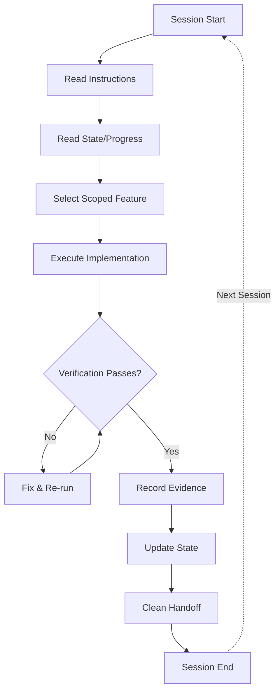
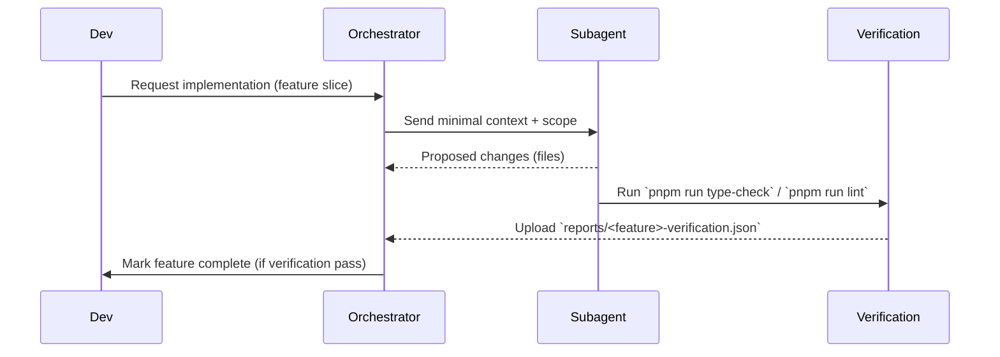
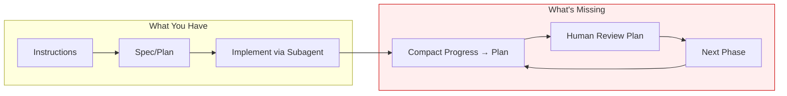

**Harness & Context Engineering Audit**

## Scope

This document captures a comprehensive, actionable audit of two complementary areas:

- **Context Engineering** — how the repository constructs, manages, and supplies contextual inputs to agents (specs, instruction slices, RAG patterns).
- **Harness Engineering** — the runtime/procedural harness that orchestrates agent work (orchestrator/subagents, session lifecycle, verification, state, and scope controls).

## Methodology

1. Read repository harness artifacts (`AGENTS.md`, `.agents/skills/*`, `.ai/*`) and representative specs (`spec/`).
2. Compare repository practices to canonical harness patterns (5-subsystem model: Instructions, State, Verification, Scope, Session Lifecycle) and context-engineering best practices (RAG, slice-first, minimal prompts).
3. Produce audit ratings, evidence, tables, remediation TODOs, and diagrams.

---

## Harness Engineering vs Context Engineering

|                  | Context Engineering                                                   | Harness Engineering                                                                |
| ---------------- | --------------------------------------------------------------------- | ---------------------------------------------------------------------------------- |
| **Focus**        | Right information → right format → right time for a _single_ LLM call | Complete operating environment for _multi-session, multi-agent_ reliable execution |
| **Scope**        | One call's context window                                             | The system the model lives inside                                                  |
| **Core Insight** | "Failures are context failures"                                       | "The model didn't change. The harness did."                                        |
| **Primitives**   | System prompt, RAG, tools, state                                      | 5 subsystems + structured lifecycle loop                                           |

Your project already does advanced context engineering. The question is: **how complete is it as a harness?**

---

## The 5 Subsystems — Your Project Scored

```
┌────────────────────────────────────────────────────────────────┐
│                     YOUR HARNESS                                │
│                                                                │
│  ┌──────────────┐  ┌──────────────┐  ┌────────────────────┐   │
│  │ Instructions │  │    State     │  │   Verification     │   │
│  │              │  │              │  │                    │   │
│  │ ⭐⭐⭐⭐⭐     │  │ ⭐⭐½         │  │ ⭐⭐⭐½            │   │
│  │              │  │              │  │                    │   │
│  └──────────────┘  └──────────────┘  └────────────────────┘   │
│                                                                │
│  ┌──────────────┐  ┌──────────────────────────────────────┐   │
│  │    Scope     │  │         Session Lifecycle            │   │
│  │              │  │                                      │   │
│  │ ⭐⭐⭐⭐½      │  │ ⭐⭐                                 │   │
│  │              │  │                                      │   │
│  └──────────────┘  └──────────────────────────────────────┘   │
│                                                                │
└────────────────────────────────────────────────────────────────┘
```

## Audit Ratings Summary

| Area                              | Rating | Rationale                                                                                                   |
| --------------------------------- | -----: | ----------------------------------------------------------------------------------------------------------- |
| Context Engineering (overall)     |    4/5 | Well-structured `spec/` and scoped instruction files; some repetitive guidance could be more machine-usable |
| Instruction Quality               |    5/5 | `AGENTS.md`, `.ai` instructions, and SKILLs are explicit and prescriptive                                   |
| Context Slicing / Minimal Prompts |    4/5 | `implement-from-spec` enforces slice-first but mechanical enforcement is manual                             |
| RAG / Retrieval Support           |    3/5 | No central index or embeddings; retrieval is manual via spec files                                          |
| Harness Engineering (overall)     |    3/5 | Clear orchestration rules exist but missing persistent state and enforced verification gates                |
| Verification & Gates              |  3.5/5 | Guidance exists but no machine-verifiable artifacts required on completion                                  |
| Session Lifecycle & Resume        |    2/5 | No checkpointing, no `.harness` state, resumability is manual                                               |

---

### 1. Instructions ⭐⭐⭐⭐⭐ (Excellent)

You nail this completely. Your progressive disclosure structure is textbook:

- `AGENTS.md` → universal operating manual
- `CLAUDE.md` / `GEMINI.md` → agent-specific persona
- `.ai/instructions/` → topic-specific deep dives (21 files)
- `.github/instructions/` → scoped `applyTo` rules
- `.agents/skills/` → invocable workflows
- `spec/{domain}/{feature}/` → implementation contracts

**L04's principle ("give a map, not an encyclopedia")** is well-served by your Canonical Instructions table and Context Bundle by Task table. The agent knows _where_ to look without loading everything.

**One gap:** The course emphasizes "progressive disclosure the agent navigates on demand." Your AGENTS.md is still ~300 lines loaded into _every_ session. Consider: what if only the first 40 lines (commands + boundaries + "read X for Y" pointers) were in AGENTS.md, and the rest was in `.ai/instructions/agents-reference.md` loaded on demand?

---

### 2. State ⭐⭐½ (Biggest Gap)

This is your harness's weakest subsystem. The harness engineering framework defines state as:

> "Track what's been done, what's in progress, and what's next. Persisted to disk so the next session picks up exactly where the last one left off."

**What you have:**

- `spec/` tree (feature-level intent)
- Git history (implicit state)
- Session store SQL database (Copilot internal)

**What you're missing:**

| Harness Primitive                  | Your Equivalent                           | Gap                                                                              |
| ---------------------------------- | ----------------------------------------- | -------------------------------------------------------------------------------- |
| `feature_list.json`                | None                                      | No machine-readable list of features with status (done/in-progress/blocked/next) |
| `claude-progress.md`               | None                                      | No persistent session handoff log                                                |
| "Definition of done" per feature   | Partially in `lld.md` acceptance criteria | Not structured as a checkable list                                               |
| `git log` reading at session start | Not instructed                            | Agent doesn't orient by checking recent commits                                  |

**Recommendation:** Add a lightweight state file:

```jsonc
// .harness/feature-status.json
{
  "features": [
    {
      "id": "category-groups",
      "domain": "architecture",
      "status": "in-progress",
      "branch": "category-groups",
      "blockers": [],
    },
    {
      "id": "reimbursements",
      "domain": "transactions",
      "status": "done",
      "completedAt": "2026-06-15",
    },
    {
      "id": "ai-image-import",
      "domain": "ai-features",
      "status": "planned",
      "spec": "spec/ai-features/ai-image-import/",
    },
  ],
}
```

And a session log:

```markdown
<!-- .harness/progress.md -->

## 2026-06-29 — category-groups branch

- Implemented filter group UI in settings
- Pending: tRPC router for CRUD, Prisma migration
- Blocked: need to decide on many-to-many vs JSON column
- Next session: start from spec/architecture/category-filter-groups/lld.md § Phase 2
```

This is what connects sessions. Without it, every agent session starts cold — it reads AGENTS.md but has no idea _where you left off_.

---

### 3. Verification ⭐⭐⭐½ (Good Foundation, Not Automated)

**What you have:**

- Validation Workflow defined: `type-check` → `lint` → `build`
- Subagent scope constraints prevent random test modifications
- e2e tests (Playwright), unit tests (Vitest)

**What's missing per the harness framework:**

> "Only a passing test suite counts as evidence. The agent cannot declare victory without runnable proof."

Your harness **defines** the verification steps but doesn't **enforce** them as a gate. The agent is told to run them, but there's no mechanism that says "you cannot claim done until these pass."

**Recommendation:** Add to AGENTS.md:

```markdown
## Verification Gate (Non-Negotiable)

Before reporting any implementation as complete:

1. Run `pnpm run type-check --quiet` — must exit 0
2. Run `pnpm run lint --quiet` — must exit 0
3. Report evidence: "✅ type-check passed, ✅ lint passed"

If either fails, fix and re-run. Do NOT report success without evidence.
A build failure is NOT "done" — it's "in progress with verification errors."
```

The key phrase from the course: _"Without the harness, step 9 becomes 'agent says it looks fine.' With the harness, step 9 is 'tests pass, lint is clean, types check.'"_

---

### 4. Scope ⭐⭐⭐⭐½ (Very Strong)

You do this well:

- Spec-driven: one feature at a time via `implement-from-spec`
- Subagent hard-scoping: "You may ONLY modify these exact files"
- "One feature at a time" is implicit in your orchestration pattern
- `spec/{domain}/{feature}/lld.md` is inherently scoped

**Minor gap:** You don't have a machine-readable "definition of done" per feature. The `lld.md` has acceptance criteria in prose, but the harness framework advocates a **checkable** format:

```markdown
## Definition of Done — category-filter-groups

- [ ] Prisma migration created and applied
- [ ] tRPC router with CRUD operations
- [ ] Settings UI renders group CRUD
- [ ] Cashflow filters respect groups
- [ ] type-check passes
- [ ] lint passes
- [ ] Unit test for router
```

This gives the agent (and you) an unambiguous completion signal.

---

### 5. Session Lifecycle ⭐⭐ (The Major Missing Piece)

The harness lifecycle loop is:

```
START → Read instructions → Run init → Read progress → Read feature list → Select ONE feature
EXECUTE → Implement → Verify → Fix → Re-verify
WRAP UP → Update progress → Update feature status → Commit clean state → Leave handoff
```

**What you have:** START is partially covered (agent reads AGENTS.md). But:

| Lifecycle Step                             | Your Coverage                           |
| ------------------------------------------ | --------------------------------------- |
| 1. Read instructions                       | ✅ AGENTS.md auto-loaded                |
| 2. Run init (verify environment health)    | ❌ No `init.sh` or equivalent           |
| 3. Read progress (what happened last time) | ❌ No progress file                     |
| 4. Read feature list (what's done/next)    | ❌ No machine-readable status           |
| 5. Check git log (recent changes)          | ❌ Not instructed                       |
| 6. Pick ONE unfinished feature             | ⚠️ Manual (user tells agent what to do) |
| 12-16. Wrap up & handoff                   | ❌ No end-of-session protocol           |

**Recommendation:** Create `.harness/init.sh` (or instruct in AGENTS.md):

```markdown
## Session Start Protocol

At the beginning of every session:

1. Read `.harness/progress.md` for where we left off
2. Check `git log --oneline -5` to see recent changes
3. Confirm: "Last session worked on X. Continuing from Y."

## Session End Protocol

Before ending work:

1. Update `.harness/progress.md` with what was done and what's next
2. If feature is complete, update `.harness/feature-status.json`
3. Ensure working tree is in a resumable state (no half-applied migrations)
```

This is what transforms your harness from "agent reads rules" to "agent operates inside a reliable system across sessions."

---

## The Loop (What Ties It All Together)



Your harness has strong **E** (execute) and decent **D** (scope), but the **A→C** (start/orient) and **H→K** (wrap-up/handoff) phases are underdeveloped.

---

## Prioritized Action Items

| Priority | Action                                                          | Harness Subsystem | Effort  |
| -------- | --------------------------------------------------------------- | ----------------- | ------- |
| 🔴 1     | Create `.harness/progress.md` + update protocol                 | State + Lifecycle | Small   |
| 🔴 2     | Add verification gate language ("report evidence")              | Verification      | Trivial |
| 🔴 3     | Create `.harness/feature-status.json`                           | State + Scope     | Small   |
| 🟡 4     | Add session start/end protocol to AGENTS.md                     | Lifecycle         | Trivial |
| 🟡 5     | Prune AGENTS.md to ~80 lines, move rest to `.ai/`               | Instructions      | Medium  |
| 🟡 6     | Add "definition of done" checklist per active feature           | Scope             | Ongoing |
| 🟢 7     | Create `init` script (type-check + lint as health check)        | Lifecycle         | Small   |
| 🟢 8     | Instruct agents to read `git log --oneline -5` at session start | State             | Trivial |

---

## Section A — Context Engineering

### Overview

Context Engineering evaluates how the repo prepares and supplies the smallest useful context slices to agents, and whether the context is structured for cost-efficient, accurate decisions.

### Key Strengths

- Spec-first layout: `spec/{domain}/{feature}/context.md` + `lld.md` gives clear low-level contracts.
- Orchestrator SKILLs demand a slice-first approach and explicit pre-delegation declarations.

### Gaps & Risks

- No machine-readable index (feature list, embeddings, or TOC) to automate retrieval.
- Ambiguity in how much of `AGENTS.md` to pass to subagents — large files increase token costs.

### Evidence

- `spec/transactions/hld.md` (domain HLD) — good canonical model excerpt.
- `.agents/skills/implement-from-spec/SKILL.md` — enforces slice-first and pre-delegation declaration.
- `.ai/instructions/spec-consolidation.md` — migration and spec hygiene guidance.

### Table: Context Comparison

| Feature           | Current                                        | Recommended                                                  |
| ----------------- | ---------------------------------------------- | ------------------------------------------------------------ |
| Spec structure    | `spec/{domain}/{feature}/context.md`, `lld.md` | Keep; add `feature-index.json` and `hld` TOC                 |
| Context retrieval | Manual file reads, ad-hoc                      | Add small retrieval index and optional embeddings for RAG    |
| Prompt slicing    | Enforced by SKILL policy                       | Automate with `feature-index.json` and index lookup template |

### Recommendations (Context)

1. Create `spec/feature-index.json` (basic metadata: domain, feature, hld/lld paths, tags). This enables programmatic retrieval.
2. Add a short `context-template.md` in `.ai/` describing the exact minimal slice to pass to subagents (max tokens, file list, examples).
3. Add optional embeddings pipeline (offshore): `scripts/build-embeddings.js` to produce `embeddings/*` for larger features where retrieval matters.

### TODOs (Context)

- [ ] Add `spec/feature-index.json` with all current features.
- [ ] Add `.ai/context-template.md` and include a copy in `implement-from-spec` SKILL.
- [ ] Optionally add an embeddings build script and sample index for the largest domains.

### Mermaid: Context Flow

```mermaid
flowchart LR
   A[Developer edits spec/{domain}/{feature}] --> B[feature-index.json]
   B --> C{Orchestrator request}
   C -->|small slice| D[Subagent prompt]
   C -->|enriched RAG| E[Retrieval (embeddings)]
   E --> D
   D --> F[Implement or propose changes]
```

## Section B — Harness Engineering

### Overview

Harness Engineering covers the runtime orchestration: how agents are launched, scoped, verified, and how state/session lifecycle is managed.

### Current State Summary

- Strong orchestration policies (`implement-from-spec` SKILL, `.ai/testing-and-subagents.md`) that restrict scope and actions.
- Missing runtime state artifacts (`.harness/*`) and no enforced verification artifact format.

### Mapping to 5 Subsystems (detail)

See the per-subsystem deep-dive above (§ The 5 Subsystems — Your Project Scored) for detailed analysis, evidence, and recommendations per subsystem.

### Evidence

- `.agents/skills/implement-from-spec/SKILL.md` — orchestrator-only rule.
- `.ai/instructions/testing-and-subagents.md` — CRITICAL CONSTRAINTS for subagents (no global lint/format, no commits).
- `AGENTS.md` — governance and policies.

### Concrete TODOs (Harness)

Priority: P0 (urgent), P1 (high), P2 (medium)

- P0: Add `.harness/feature-status.json` template and `.harness/README.md` describing fields and use.
- P0: Add `reports/verification-schema.json` and enforce in `implement-from-spec` SKILL that every completed phase produces a `reports/<feature>-verification.json` with:
  - `commands`: array of executed commands (exact strings).
  - `outputs`: stdout/stderr snippets.
  - `files_changed`: list of files and their SHAs.
  - `status`: pass/fail.
- P1: Add `scripts/init-harness.sh` (or `init-harness.ps1`) to bootstrap `.harness` and create initial `feature-status.json` entries.
- P1: Add a small check script `scripts/check-scope.js` that compares changed files (git diff) to allowed files passed to subagent and fails if out-of-scope.
- P2: Add CI job (optional) `verify/harness-verification` which validates `reports/*` files conform to schema.

### Mermaid: Session Lifecycle



### Example `feature-status.json` (suggested schema)

```json
{
  "features": [
    {
      "id": "transactions-import-1",
      "state": "in-progress",
      "lastUpdated": "2026-06-29T12:00:00Z",
      "owner": "alice"
    }
  ]
}
```

---

## Section C — HumanLayer / CodeLayer Practices Evaluation

### Source

[HumanLayer: Advanced Context Engineering for Coding Agents](https://github.com/humanlayer/advanced-context-engineering-for-coding-agents/blob/main/ace-fca.md) (dexhorthy, Aug 2025) and the [CodeLayer Workshop](https://github.com/humanlayer/humanlayer/blob/main/docs/workshop.mdx).

### Core Principles (from HumanLayer)

| Principle                           | Description                                                                                                |
| ----------------------------------- | ---------------------------------------------------------------------------------------------------------- |
| **Frequent Intentional Compaction** | Design the ENTIRE workflow around context management; keep utilization in 40-60% range                     |
| **Research → Plan → Implement**     | Three distinct phases with human review at each compaction boundary                                        |
| **High-Leverage Human Review**      | Review research and plans (not just code) — a bad line of research leads to thousands of bad lines of code |
| **Sub-agents = Context Control**    | Not about anthropomorphizing roles; about keeping the parent's context window clean                        |
| **Specs as the New Code**           | Specs, plans, and research are first-class artifacts, committed to the repo                                |
| **Mental Alignment**                | The primary purpose of specs/plans is keeping team members on the same page                                |
| **Context Optimization Priorities** | 1. Correctness, 2. Completeness, 3. Size, 4. Trajectory                                                    |
| **Three-tier Risk Classification**  | Low / Medium / High stakes operations with deterministic human gates                                       |
| **Phase-by-phase compaction**       | After each implementation phase, compact progress back into the plan file                                  |

### Your Project Scored Against HumanLayer Practices

| Practice                            | Your Repo                                         | Rating | Gap                                                                |
| ----------------------------------- | ------------------------------------------------- | -----: | ------------------------------------------------------------------ |
| Research → Plan → Implement         | PRD mode + spec-first + `implement-from-spec`     |    4/5 | No explicit "research" phase artifact; PRD skips codebase research |
| Frequent Intentional Compaction     | Not instructed anywhere                           |    2/5 | No guidance on when/how to compact; no `progress.md` handoff       |
| High-Leverage Human Review          | AGENTS.md says "ask before commit"                |    3/5 | Review is on code/PR, not on research/plan — lower leverage        |
| Sub-agents for context control      | `implement-from-spec` SKILL + strict file scoping |    5/5 | Excellent — sub-agents are explicitly for context isolation        |
| Specs as first-class artifacts      | `spec/{domain}/{feature}/` committed to repo      |    5/5 | Strong; specs are versioned and structured                         |
| Mental Alignment                    | Specs + domain HLDs                               |    4/5 | Missing: team-wide "what changed this week" summary artifact       |
| Context optimization                | Slice-first rule in SKILL                         |    4/5 | No explicit budget/utilization tracking                            |
| Three-tier risk classification      | Partial in AGENTS.md (Never/Ask/Do)               |    3/5 | Not formalized as a tiered model with examples                     |
| Phase-by-phase compaction           | Not present                                       |    1/5 | After each phase, no instruction to compact progress back to plan  |
| Thoughts / external knowledge store | None                                              |    1/5 | No cross-session, cross-project knowledge sharing                  |

### Key Insight: "The Compaction Gap"

Your repo has excellent **beginning** (instructions + specs) and **middle** (scoped implementation via sub-agents), but is missing the **compaction discipline** that bridges phases and sessions:



### Three-Tier Risk Model (recommended)

Formalize the implicit "Never / Ask First / Do" pattern in AGENTS.md as an explicit tiered model:

| Tier                          | Risk Level | Examples in Your Repo                                                 | Gate                                  |
| ----------------------------- | ---------- | --------------------------------------------------------------------- | ------------------------------------- |
| **Tier 1** (Always OK)        | Low        | Read files, run type-check, run lint, search codebase                 | None                                  |
| **Tier 2** (Ask First)        | Medium     | Edit source files, run migrations, modify DB schema, create branches  | Human review of plan                  |
| **Tier 3** (Never Autonomous) | High       | `git push`, `prisma migrate reset`, deploy to production, delete data | Explicit user confirmation + evidence |

### Recommended: Compaction Protocol

Add to AGENTS.md or `.ai/instructions/compaction.md`:

```markdown
## Compaction Protocol (after each implementation phase)

After completing a phase:

1. Update the plan/lld.md with:
   - ✅ Steps completed (with file paths)
   - ❌ Steps that failed and why
   - 🔜 Next steps remaining
2. If context is >50% utilized, start a new session with:
   - The updated plan file
   - `git log --oneline -5`
   - `.harness/progress.md` (latest entry)
3. Write a 3-5 line session handoff to `.harness/progress.md`
```

### Recommended: Research Phase

Your PRD mode generates requirements but skips **codebase research**. Add a research step:

```markdown
## Research Phase (before planning)

1. Read the issue/feature request
2. Spawn a research sub-agent to identify:
   - Relevant files and line numbers
   - How the system works today
   - Potential approaches and tradeoffs
3. Write output to `thoughts/<feature>-research.md`
4. Human reviews research BEFORE planning begins
```

### TODO Annotations (from HumanLayer)

Adopt the priority-based TODO system in code:

| Annotation | Meaning                              | Merge Policy     |
| ---------- | ------------------------------------ | ---------------- |
| `TODO(0)`  | Critical — never merge               | Block CI         |
| `TODO(1)`  | High — architectural flaw, major bug | Block release    |
| `TODO(2)`  | Medium — minor bug, missing feature  | Track in backlog |
| `TODO(3)`  | Low — polish, tests, docs            | Best effort      |
| `TODO(4)`  | Questions / investigations needed    | Discuss in PR    |
| `PERF`     | Performance optimization opportunity | Track separately |

### Prioritized HumanLayer-Inspired Action Items

| Priority | Action                                                       | Effort  |
| -------- | ------------------------------------------------------------ | ------- |
| 🔴 1     | Add compaction protocol to `.ai/instructions/compaction.md`  | Trivial |
| 🔴 2     | Formalize three-tier risk model in AGENTS.md                 | Trivial |
| 🔴 3     | Add phase-by-phase compaction to `implement-from-spec` SKILL | Small   |
| 🟡 4     | Add research phase (sub-agent + `thoughts/` output)          | Medium  |
| 🟡 5     | Adopt TODO(0-4) annotation system in contributing guide      | Trivial |
| 🟡 6     | Create `.harness/progress.md` for session handoff            | Small   |
| 🟢 7     | Add "weekly alignment" summary artifact generation           | Medium  |
| 🟢 8     | Explore external "thoughts" repo for cross-project knowledge | Large   |

---

## Summary

Your harness is **architecturally sophisticated** — the instruction layer and scope control rival anything in production. But it's optimized for the _single-session, human-supervised_ workflow.

**From the 5-subsystem harness model:** The gap between sessions is where reliability dies. Your specs are excellent, your subagent delegation is battle-tested, but there's no persistent state mechanism bridging sessions, and no structured lifecycle loop ensuring the agent orients before acting and hands off before stopping.

**From HumanLayer's frequent intentional compaction:** The gap between _phases_ is where context degrades. Your workflow goes Instructions → Spec → Implement, but lacks the compaction step that writes progress back to the plan after each phase. This means long features accumulate stale context and force cold-start re-orientation.

**Combined insight:** You need two lightweight bridges:

1. **Between phases** — compaction protocol (write progress back to plan/lld after each phase)
2. **Between sessions** — session lifecycle protocol (`.harness/progress.md` + init/wrap-up)

The fix is lightweight — ~3 new files, ~30 lines added to AGENTS.md, and a small update to the `implement-from-spec` SKILL. The payoff is deterministic resume, higher human leverage, and significantly less re-explanation across sessions and phases.

## Appendix: Sources and Evidence

**Files inspected:**

- `AGENTS.md`, `.agents/skills/implement-from-spec/SKILL.md`, `.ai/instructions/testing-and-subagents.md`
- `spec/transactions/hld.md`, `CLAUDE.md`, `GEMINI.md`

**External references:**

- [Claude Code best practices](https://www.anthropic.com/engineering/claude-code-best-practices)
- [GitHub Copilot custom instructions](https://docs.github.com/en/copilot/customizing-copilot/adding-repository-custom-instructions-for-github-copilot)
- [walkinglabs "learn-harness-engineering"](https://github.com/walkinglabs/learn-harness-engineering) (5-subsystem model)
- [HumanLayer: Advanced Context Engineering for Coding Agents](https://github.com/humanlayer/advanced-context-engineering-for-coding-agents/blob/main/ace-fca.md)
- [HumanLayer CodeLayer Workshop](https://github.com/humanlayer/humanlayer/blob/main/docs/workshop.mdx)
- [HumanLayer SDK docs (three-tier risk model)](https://github.com/humanlayer/humanlayer/blob/main/humanlayer.md)

**Verification command (copyable):**

```bash
pnpm run type-check --silent && pnpm run lint --silent
```
