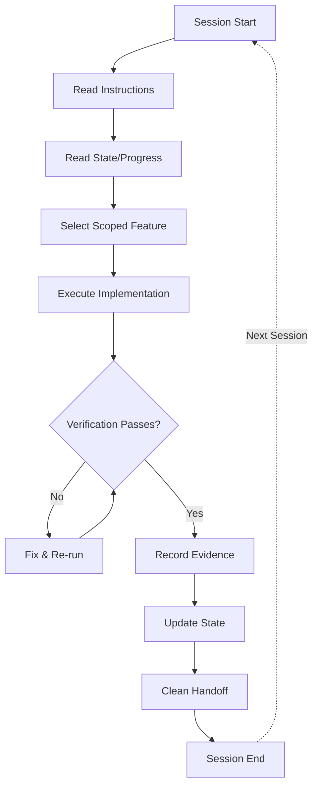
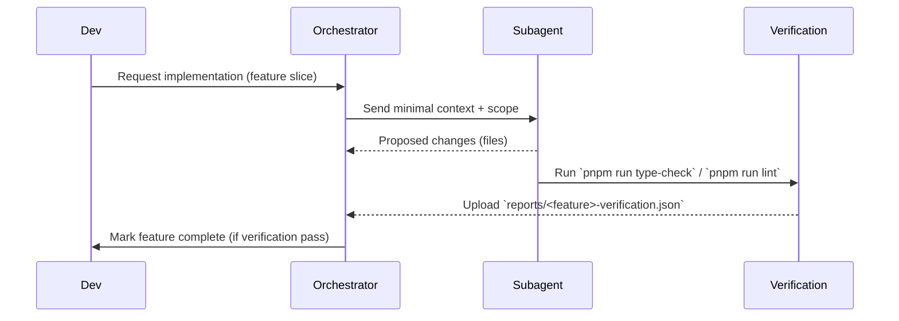
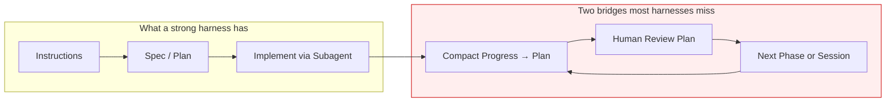

# Harness & Context Engineering — Learnings

**Purpose:** Framework, principles, and templates for agent harness design. Timeless content extracted from the original 2026-06-29 audit so that the audit file (`docs/harness-audit.md`) can remain a pure point-in-time findings log.

**Status:** Reference. Update when you adopt a new framework, model, or template — not when you re-audit the repo.

> Audit findings (ratings, gaps, evidence specific to this repo) live in `docs/harness-audit.md`.
> Runbooks (multi-session workflows) live alongside as `docs/{name}-runbook.md`.
> This file is the *why* and *what good looks like* — not the *what's broken today*.

---

## Definitions

### Harness Engineering vs Context Engineering

|                  | Context Engineering                                                   | Harness Engineering                                                                |
| ---------------- | --------------------------------------------------------------------- | ---------------------------------------------------------------------------------- |
| **Focus**        | Right information → right format → right time for a *single* LLM call | Complete operating environment for *multi-session, multi-agent* reliable execution |
| **Scope**        | One call's context window                                             | The system the model lives inside                                                  |
| **Core Insight** | "Failures are context failures"                                       | "The model didn't change. The harness did."                                        |
| **Primitives**   | System prompt, RAG, tools, state                                      | 5 subsystems + structured lifecycle loop                                           |

Context Engineering is necessary but not sufficient. A harness is what makes context engineering reproducible across sessions and operators.

---

## The 5-Subsystem Model

Adapted from [walkinglabs/learn-harness-engineering](https://github.com/walkinglabs/learn-harness-engineering). Every production-grade harness has five distinct subsystems; weaknesses in any one cap the effective quality of the whole.

```
┌────────────────────────────────────────────────────────────────┐
│                          HARNESS                                │
│                                                                │
│  ┌──────────────┐  ┌──────────────┐  ┌────────────────────┐   │
│  │ Instructions │  │    State     │  │   Verification     │   │
│  └──────────────┘  └──────────────┘  └────────────────────┘   │
│                                                                │
│  ┌──────────────┐  ┌──────────────────────────────────────┐   │
│  │    Scope     │  │         Session Lifecycle            │   │
│  └──────────────┘  └──────────────────────────────────────┘   │
│                                                                │
└────────────────────────────────────────────────────────────────┘
```

### 1. Instructions

How rules are *authored, layered, and disclosed* to the agent. Best-practice pattern is **progressive disclosure**:

- Universal entry point (`AGENTS.md`) — always loaded, compact map.
- Topic deep-dives (`.ai/instructions/<topic>.md`) — loaded on demand.
- Scoped rules (`.github/instructions/*.instructions.md`) — auto-injected by file glob.
- Skills (`.agents/skills/<name>/SKILL.md`) — invocable multi-step workflows.

Anti-patterns: monolithic `AGENTS.md`, duplicated rules across files, no canonical index pointing to detail files.

### 2. State

What persists *between* sessions. The minimum viable set:

| Artifact                  | Purpose                                                         |
| ------------------------- | --------------------------------------------------------------- |
| Feature registry (JSON)   | Machine-readable: id, status, branch, definition of done        |
| Session handoff log (MD)  | Human-readable: what was done, what's next, blockers            |
| Code↔spec ownership map   | Which spec governs which file (drift detection prerequisite)    |
| Verified-sha per artifact | Enables `git diff $sha..HEAD -- $owns` for cheap drift checks   |

State that lives only in the LLM's context window is not state — it evaporates at session end.

### 3. Verification

The mechanism that converts "agent says done" into "we can prove done." Two flavours:

- **Deterministic gates** — type-check, lint, build, custom scripts (`spec:check`). Sub-second, no LLM, reproducible.
- **Evidence artifacts** — recorded command output, screenshots, test IDs. Required for "done" status transitions.

A verification *guidance* (telling the agent what to run) is weak. A verification *gate* (refusing the "done" transition until evidence exists) is strong.

### 4. Scope

How the harness constrains *what the agent may touch* in a given turn. Layered constraints work best:

- Single-active-feature rule at the harness level.
- Explicit file lists in subagent prompts (`⚠️ CRITICAL CONSTRAINTS` block).
- Feature-boundary `owns[]` blocks in the manifest.
- Risk-tier classification (Tier 1/2/3 — see below).

Without scope, agents drift sideways into "while I'm here…" changes that destroy auditability.

### 5. Session Lifecycle

The procedural loop the harness imposes:

```
START → Read instructions → Run init → Read progress → Read feature list → Select ONE feature
EXECUTE → Implement → Verify → Fix → Re-verify
WRAP UP → Update progress → Update feature status → Commit clean state → Leave handoff
```

START is what catches drift from the previous session. WRAP-UP is what *prevents* drift into the next. The middle is the agent's actual work.



---

## HumanLayer Principles (Advanced Context Engineering)

From [humanlayer/advanced-context-engineering-for-coding-agents](https://github.com/humanlayer/advanced-context-engineering-for-coding-agents/blob/main/ace-fca.md) (dexhorthy, Aug 2025) and the [CodeLayer Workshop](https://github.com/humanlayer/humanlayer/blob/main/docs/workshop.mdx).

| Principle                           | Description                                                                                                |
| ----------------------------------- | ---------------------------------------------------------------------------------------------------------- |
| **Frequent Intentional Compaction** | Design the entire workflow around context management; keep utilization in 40–60% range                     |
| **Research → Plan → Implement**     | Three distinct phases with human review at each compaction boundary                                        |
| **High-Leverage Human Review**      | Review research and plans (not just code) — a bad line of research leads to thousands of bad lines of code |
| **Sub-agents = Context Control**    | Not about anthropomorphizing roles; about keeping the parent's context window clean                        |
| **Specs as the New Code**           | Specs, plans, and research are first-class artifacts, committed to the repo                                |
| **Mental Alignment**                | The primary purpose of specs/plans is keeping team members on the same page                                |
| **Context Optimization Priorities** | 1. Correctness  2. Completeness  3. Size  4. Trajectory                                                    |
| **Three-tier Risk Classification**  | Low / Medium / High stakes operations with deterministic human gates                                       |
| **Phase-by-phase compaction**       | After each implementation phase, compact progress back into the plan file                                  |

---

## Reusable Templates

### Three-Tier Risk Model

The deterministic risk gate every harness should formalise:

| Tier                          | Risk Level | Examples                                                              | Gate                                  |
| ----------------------------- | ---------- | --------------------------------------------------------------------- | ------------------------------------- |
| **Tier 1** (Always OK)        | Low        | Read files, run type-check, run lint, search codebase, `git log`      | None                                  |
| **Tier 2** (Ask First)        | Medium     | Edit source files, modify specs, run migrations, create branches      | Human review of plan                  |
| **Tier 3** (Never Autonomous) | High       | `git push`, `prisma migrate reset`, deploy to production, delete data | Explicit user confirmation + evidence |

Place this verbatim near the top of `AGENTS.md`. The exact verbs/examples vary by repo; the *shape* should not.

### Compaction Protocol

Add to `AGENTS.md` or `.ai/instructions/compaction.md`:

```markdown
## Compaction Protocol (after each implementation phase)

After completing a phase:

1. Update the plan/lld.md with:
   - ✅ Steps completed (with file paths)
   - ❌ Steps that failed and why
   - 🔜 Next steps remaining
2. If context is >50% utilized, start a new session with:
   - The updated plan file
   - `git log --oneline -5`
   - `.harness/progress.md` (latest entry)
3. Write a 3-5 line session handoff to `.harness/progress.md`
```

### Research Phase Template

PRD-mode workflows often skip codebase research, which produces plans that look good on paper but ignore existing patterns. Insert a research step:

```markdown
## Research Phase (before planning)

1. Read the issue / feature request
2. Spawn a research sub-agent to identify:
   - Relevant files and line numbers
   - How the system works today
   - Potential approaches and tradeoffs
3. Write output to `thoughts/<feature>-research.md`
4. Human reviews research BEFORE planning begins
```

### TODO Annotation System

Priority-based TODO grammar — drives CI policy without ambiguity:

| Annotation | Meaning                              | Merge Policy     |
| ---------- | ------------------------------------ | ---------------- |
| `TODO(0)`  | Critical — never merge               | Block CI         |
| `TODO(1)`  | High — architectural flaw, major bug | Block release    |
| `TODO(2)`  | Medium — minor bug, missing feature  | Track in backlog |
| `TODO(3)`  | Low — polish, tests, docs            | Best effort      |
| `TODO(4)`  | Questions / investigations needed    | Discuss in PR    |
| `PERF`     | Performance optimization opportunity | Track separately |

### Feature-Status Schema (minimum viable)

```jsonc
{
  "features": [
    {
      "id": "kebab-case-id",
      "domain": "domain-name",
      "status": "planned" | "in-progress" | "blocked" | "done",
      "branch": "git-branch",
      "spec": "spec/{domain}/{feature}/",
      "blockers": [],
      "verification": [
        { "id": "type-check", "description": "...", "passing": false }
      ],
      "evidence": [
        { "verificationId": "type-check", "at": "ISO 8601", "summary": "...", "commit": "abc1234" }
      ]
    }
  ]
}
```

**Definition-of-Done rule:** a feature may only transition `in-progress → done` when every `verification[].passing === true`, and each `passing: true` must have at least one matching entry in `evidence[]`.

---

## Patterns and Mermaid Diagrams

### Context Flow

```mermaid
flowchart LR
   A[Developer edits spec/{domain}/{feature}] --> B[spec/index.json]
   B --> C{Orchestrator request}
   C -->|small slice| D[Subagent prompt]
   C -->|enriched RAG| E[Retrieval / embeddings]
   E --> D
   D --> F[Implement or propose changes]
```

### Subagent Verification Lifecycle



### The Compaction Gap



**Two lightweight bridges** close the most common gap:

1. **Between phases** — compaction protocol writes progress back to plan/lld after each phase.
2. **Between sessions** — session lifecycle protocol (`.harness/progress.md` + init/wrap-up rituals).

---

## Defense-in-Depth: Drift Mechanics

Drift between spec and code is the dominant long-term failure mode. Three-layer defence:

| Layer | When it fires      | Mechanism                                              | Survives ungraceful kill? |
| ----- | ------------------ | ------------------------------------------------------ | ------------------------- |
| **1 — Graceful**  | End of session     | Agent ritual: run drift check, paste totals into progress entry | ❌ No  |
| **2 — Preventive** | Pre-commit / pre-push / CI | Deterministic script (`spec:check:strict`) blocks pushes with drift | ✅ Yes |
| **3 — Corrective** | Weekly / monthly  | Scheduled job opens issues / drafts capsule PRs        | ✅ Yes |

**Trust gradient:** drift detection only delivers value if the baseline is trusted. Order of build-out matters:

```
unverified manifest  →  clean manifest  →  enforced manifest  →  monitored manifest
       (start)           (triage done)         (Layer 2)            (Layer 3)
```

Skipping straight from "unverified" to "enforced" produces false positives that erode trust in the gate, and the gate dies.

---

## Cheap-Model Friendliness — Design Constraints

If the harness must run on Haiku-class / GPT-5-mini-class models economically, design under these constraints:

1. **Capsule format for shipped features.** Replace ≥3 KB `lld.md` auto-load with ≤800-token `reference.md`. Anthropic's July 2025 "Context Rot" paper: accuracy degrades log-linearly past ~30 K tokens.
2. **Manifest-driven retrieval.** Cheap models burn budget on exploration. A `spec/index.json` that maps file → feature → docs makes lookup O(1).
3. **Explicit protocols.** Encoded decision rubrics (e.g. the DDD CLAIM→EXTRACT→DOUBT→RECONCILE→STOP loop) let cheap models execute rather than invent. Open-ended reasoning is where cheap models hallucinate.
4. **Cite-or-flag gates.** Force every external API call through `// SOURCE:` / `// VERIFIED-LOCAL:` / `// UNVERIFIED:` markers. Eliminates the dominant cheap-model failure mode (invented framework APIs).
5. **Orchestrator ≠ reasoner.** For triage / dispatch / judging-confidence tasks, mid-tier orchestrators (Sonnet 4.6 medium) outperform top-tier reasoners (Opus). Reasoning depth is wasted on protocol-following.

---

## Sources

- [walkinglabs / learn-harness-engineering](https://github.com/walkinglabs/learn-harness-engineering) — 5-subsystem model.
- [HumanLayer: Advanced Context Engineering for Coding Agents](https://github.com/humanlayer/advanced-context-engineering-for-coding-agents/blob/main/ace-fca.md) — frequent intentional compaction.
- [HumanLayer CodeLayer Workshop](https://github.com/humanlayer/humanlayer/blob/main/docs/workshop.mdx) — research→plan→implement.
- [HumanLayer SDK / three-tier risk](https://github.com/humanlayer/humanlayer/blob/main/humanlayer.md).
- [Anthropic — Claude Code best practices](https://www.anthropic.com/engineering/claude-code-best-practices).
- [Anthropic — Building effective agents](https://www.anthropic.com/research/building-effective-agents) (Jan 2025).
- [Anthropic — "Context Rot" empirical study](https://www.anthropic.com/research/context-rot) (Jul 2025).
- [GitHub Copilot custom instructions](https://docs.github.com/en/copilot/customizing-copilot/adding-repository-custom-instructions-for-github-copilot).
- [addyosmani / agent-skills](https://github.com/addyosmani/agent-skills) — production-grade skill pack (`source-driven-development`, `doubt-driven-development` inspiration).
