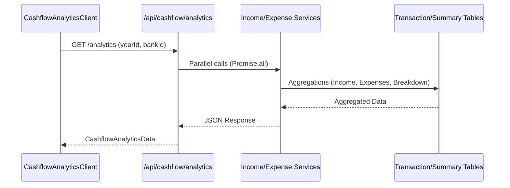

# Cashflow Analytics Dashboard — Low Level Design

## Service Contracts

| Action | Service Call |
|---|---|
| Get Monthly Income | `getMonthlyIncomeSummaryFiltered()` |
| Get Income Breakdown | `getIncomeSourceBreakdownForYear()` |
| Get Expense Breakdown | `getExpenseCategoryBreakdownForYear()` |

## UX Flow: Analytics Data Fetch

