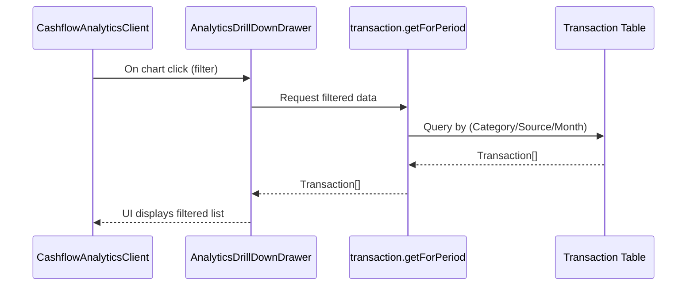

# Analytics Drill-Down — Low Level Design

## Service Contracts

| Action | Service Call |
|---|---|
| Get Filtered Transactions | `getForPeriod()` |

## UX Flow: Drill-Down

```mermaid
sequenceDiagram
  participant UI as CashflowAnalyticsClient
  participant Drawer as AnalyticsDrillDownDrawer
  participant TRPC as transaction.getForPeriod
  participant DB as Transaction Table

  UI->>Drawer: On chart click (filter)
  Drawer->>TRPC: Request filtered data
  TRPC->>DB: Query by (Category/Source/Month)
  DB-->>TRPC: Transaction[]
  TRPC-->>Drawer: Transaction[]
  Drawer-->>UI: UI displays filtered list
```
