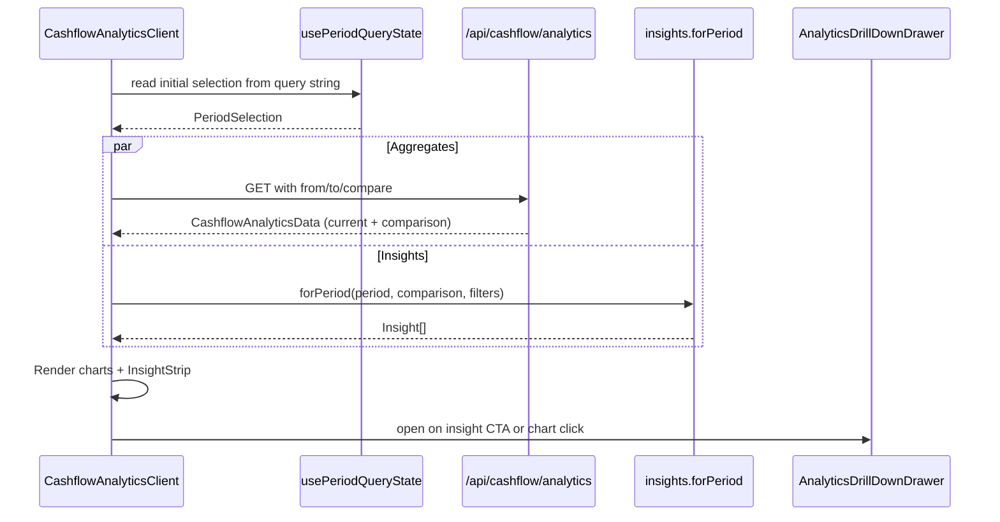

# Analytics Insights Upgrade — Low Level Design

## Service Contracts

| Action | Service Call |
|---|---|
| Fetch analytics aggregates | existing `/api/cashflow/analytics` (extended to accept `from`/`to`/`compareFrom`/`compareTo`) |
| Fetch ranked insights | `insights.forPeriod` (Phase 1) |
| Drill-down transactions | existing `transaction.getForPeriod` |

## UI Component Changes

| Component | Change |
|---|---|
| `CashflowAnalyticsClient` | Swap `CalendarYearPicker` → `<PeriodPicker>`; wire `usePeriodQueryState`; render `<InsightStrip>` above charts |
| `IncomeSourceChart` | Group to Top-5 + Other; add log-scale toggle button; sparkline column on the supporting list |
| `ExpenseCategoryChart` | Sparkline + delta column; preserve current bar layout |
| `IncomeExpenseTrendChart` | Accept optional `comparisonSeries`; render as ghost bars at 40% opacity |
| `NetCashflowChart` | Accept optional `comparisonSeries`; render as dashed line |
| `InsightStrip` (new) | `Analytics/_components/InsightStrip.tsx` — horizontal scroll of `<InsightCard>`s, max 5 |

## API Extension

```
GET /api/cashflow/analytics
  ?from=YYYY-MM-DD&to=YYYY-MM-DD
  &compareFrom=YYYY-MM-DD&compareTo=YYYY-MM-DD   (optional)
  &bankAccountId=…&incomeCategoryIds=…&expenseCategoryIds=…
```

Backwards-compatible: when `from`/`to` absent, fall back to `calendarYearId` resolution.

## UX Flow



## Verification Gate

- `pnpm run type-check`
- `pnpm run lint`
- `pnpm spec:check`
- Manual flow: change preset → URL updates → reload page → state restored.
- Manual flow: enable compare-to-prior-year → second series renders on both line + bar charts.
- Screenshot of new InsightStrip + sparkline columns attached to the handoff entry.
