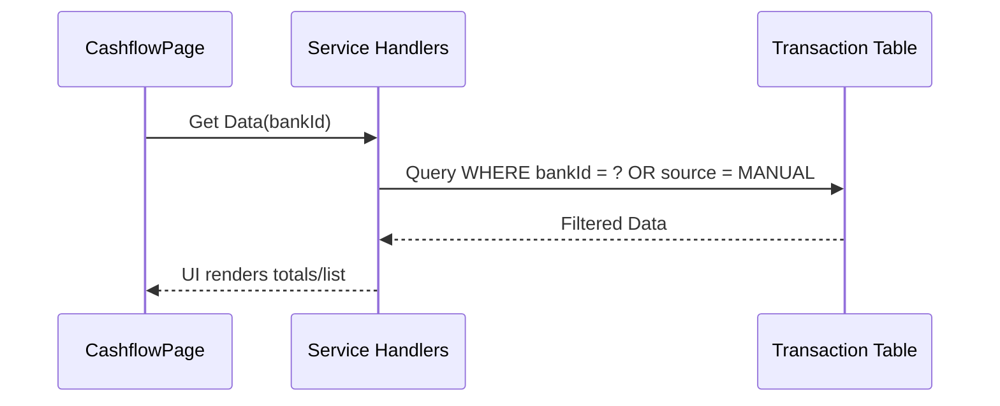

# Bank Account Filter Parity — Low Level Design

## Service Contracts

| Action | Service Call |
|---|---|
| Get Data | `getData(bankAccountId?)` |

## UX Flow: Bank Filtering

```mermaid
sequenceDiagram
  participant UI as CashflowPage
  participant Service as Service Handlers
  participant DB as Transaction Table

  UI->>Service: Get Data(bankId)
  Service->>DB: Query WHERE bankId = ? OR source = MANUAL
  DB-->>Service: Filtered Data
  Service-->>UI: UI renders totals/list
```
