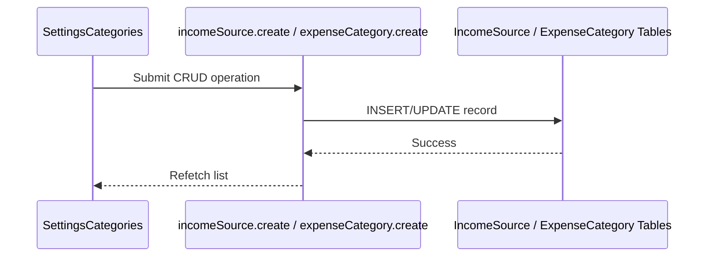

# Category Management — Low Level Design

## Service Contracts

| Action | Service Call |
|---|---|
| List Sources/Categories | `getAllActive()` |
| CRUD Operations | `create()`, `rename()`, `deactivate()` |

## UX Flow: Management

