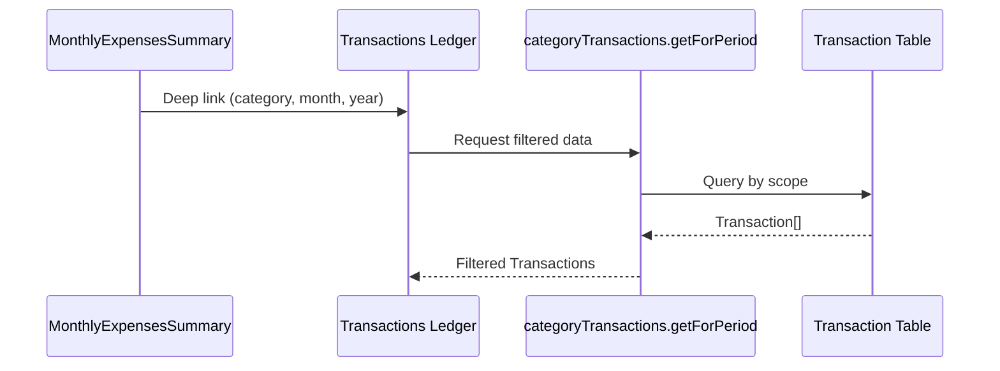

# Category Drill-Down — Low Level Design

## Service Contracts

| Action | Service Call |
|---|---|
| Get Transactions | `getForPeriod()` |

## UX Flow: Drill-Down

```mermaid
sequenceDiagram
  participant UI as MonthlyExpensesSummary
  participant URL as Transactions Ledger
  participant TRPC as categoryTransactions.getForPeriod
  participant DB as Transaction Table

  UI->>URL: Deep link (category, month, year)
  URL->>TRPC: Request filtered data
  TRPC->>DB: Query by scope
  DB-->>TRPC: Transaction[]
  TRPC-->>URL: Filtered Transactions
```
