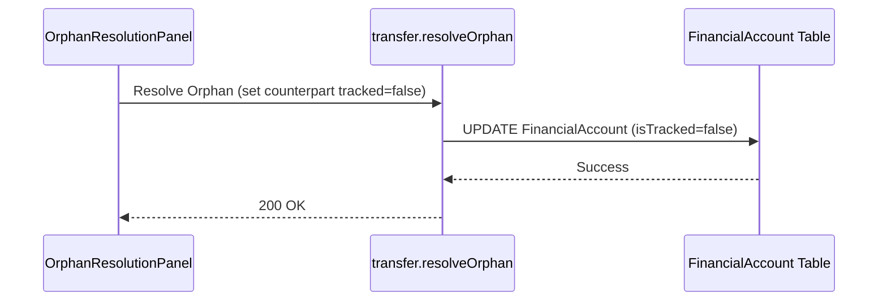

# Contextual Account Tracking — Low Level Design

## Service Contracts

| Action | Service Call |
|---|---|
| Update Tracking | `updateTracking()` |

## UX Flow: Orphan Resolution

```mermaid
sequenceDiagram
  participant UI as OrphanResolutionPanel
  participant TRPC as transfer.resolveOrphan
  participant DB as FinancialAccount Table

  UI->>TRPC: Resolve Orphan (set counterpart tracked=false)
  TRPC->>DB: UPDATE FinancialAccount (isTracked=false)
  DB-->>TRPC: Success
  TRPC-->>UI: 200 OK
```
