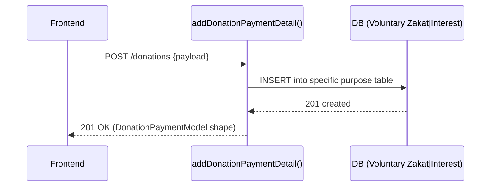
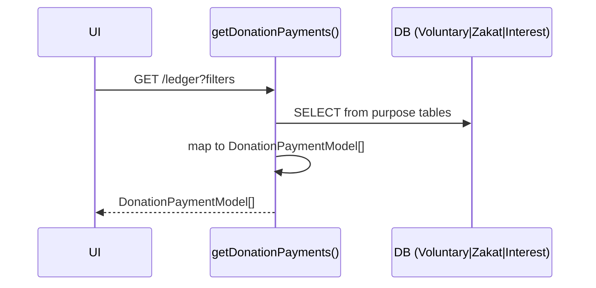

# Donations - Low Level Design

## Domain Architecture
The persistence layer is split into purpose-specific models. The service layer (`donation.service.ts`) handles mapping these to a unified `DonationPaymentModel` DTO for the frontend.

### Persistence Models
- `VoluntaryDonation`
- `InterestCleansing`
- `ZakatPayment`

## Server Contracts & Service Calls

| Action | Service Call |
|---|---|
| Create | `addDonationPaymentDetail()` |
| Update | `updateDonationPayment()` |
| Delete | `deleteDonationPayment()` |
| Read Payments | `getDonationPayments()` |
| Get Totals | `getDonationTotalsByCategory()` |

## UX Flows

### 1) Create Donation

### 2) Ledger Display

