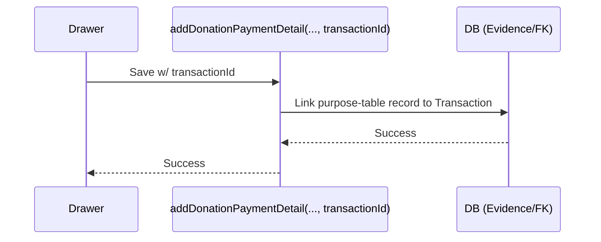

# Transaction Linking — Low Level Design

## Data Flow
1. Server detects unlinked `DEBIT` + `CONFIRMED` transactions via `getUnlinkedDonationTransactions()`.
2. Drawer UI completes beneficiary/purpose metadata.
3. Save calls `addDonationPaymentDetail()` with `transactionId` populated.
4. Linked transaction is reclassified and updated.

## Service Mapping
| Goal | Service/Action |
|---|---|
| Get Candidates | `getUnlinkedDonationTransactions()` |
| Create Link | `addDonationPaymentDetail()` |

