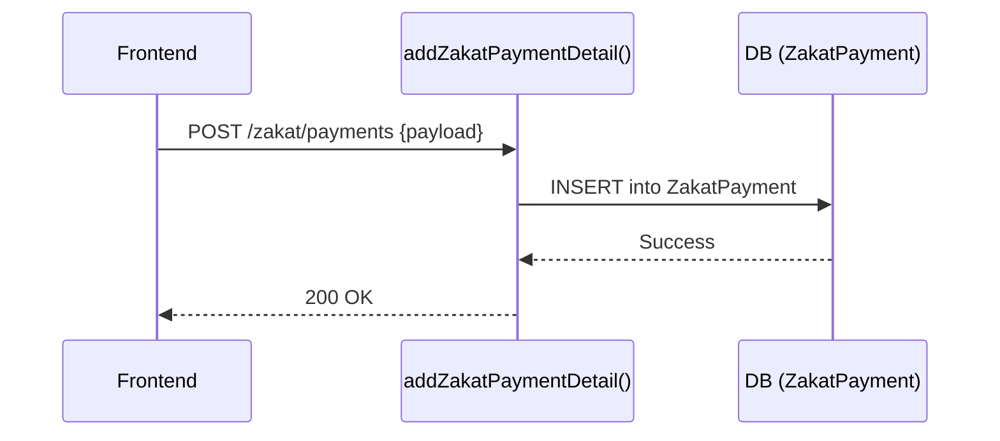

# Zakat - Low Level Design

## Server Contracts

| Action | Service Call |
|---|---|
| Create | `addZakatPaymentDetail()` |
| Update | `updateZakatPayment()` |
| Delete | `deleteZakatPayment()` |
| Read Payments | `getZakatPayments()` |

## UX Flows

### 1) Create Zakat Payment

