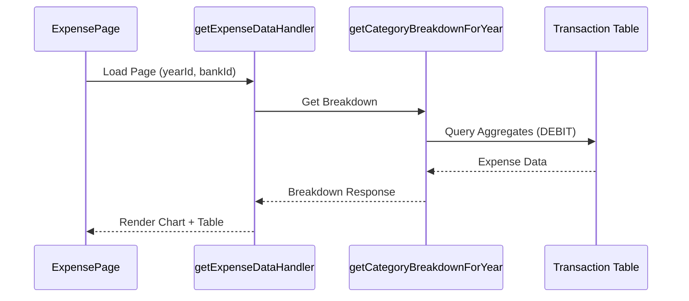

# Expense Tracking — Low Level Design

## Service Contracts

| Action | Service Call |
|---|---|
| Read Expenses | `getExpenseEntriesForMonth()` |
| Breakdown | `getCategoryBreakdownForYear()` |

## UX Flow: Expense Management

