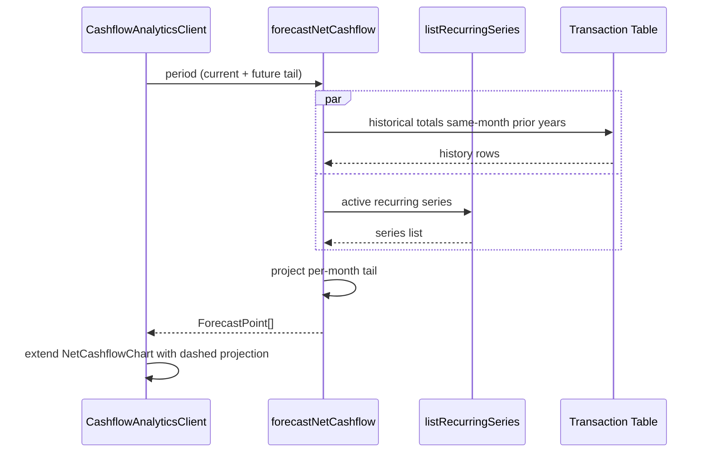

# Cashflow Forecasting & Anomalies — Low Level Design

## Service Contracts

```ts
// src/server/services/forecast/forecast.service.ts
export type ForecastPoint = {
  month: string; year: number; label: string;
  projectedIncome: number;
  projectedExpenses: number;
  projectedNet: number;
  basis: 'seasonal_naive' | 'current_pace';
};

export function forecastNetCashflow(input: {
  userId: string;
  period: DateRange;
  bankAccountId?: string;
}): Promise<ForecastPoint[]>;

// src/server/services/forecast/anomalies.service.ts
export type AnomalyFlag = {
  categoryId: string;
  month: string; year: number;
  amount: number;
  mean: number;
  stdev: number;
  zScore: number;        // |amount - mean| / stdev
  direction: 'above' | 'below';
};

export function detectMonthlyAnomalies(input: {
  userId: string;
  period: DateRange;
  threshold?: number;   // default 1.5
}): Promise<AnomalyFlag[]>;
```

## Forecast Algorithm (seasonal-naive)

```
for each future month M in period (M > today):
  recurring_M = sum(expectedAmount for active RecurringSeries where cadence falls in M)
  history     = totals for samePosition(M) in prior 1-3 years
  if history.length >= 2:
    baseline_M = mean(history) - recurring_seen_in_same_history_month
    projected_M = baseline_M + recurring_M
    basis       = 'seasonal_naive'
  else:
    # fallback: current-pace
    paceDaily   = MTD_spend / days_elapsed
    projected_M = paceDaily * days_in_M
    basis       = 'current_pace'
```

## Anomaly Algorithm

```
for each category C:
  rollingWindow = last 6 months prior to flagged month
  mean    = mean(rollingWindow)
  stdev   = stdev(rollingWindow)
  if stdev == 0: skip
  z = abs(amount - mean) / stdev
  if z >= threshold: emit AnomalyFlag
```

## Chart Integration

| Chart | Change |
|---|---|
| `NetCashflowChart` (Phase 2) | Accept optional `forecast: ForecastPoint[]`; render as dashed line with distinct colour and legend item "Projected" |
| `ExpenseCategoryChart` (Phase 2) | Accept optional `bands: { categoryId: {mean, low, high} }[]`; render faint shaded band per row when hovered |
| `MonthlyExpenseTable` (Phase 3) | Render `⚠` flag on rows with an `AnomalyFlag` matching that (month, category); tooltip shows z-score and rolling baseline |
| `CalendarHeatmap` (new) | Small component on Expense Summary; cell colour intensity = daily spend percentile |

## UX Flow (forecast)



## Verification Gate

- `pnpm run type-check`
- `pnpm run lint`
- `pnpm spec:check`
- Unit tests for `forecastNetCashflow` — fallback to current-pace when history < 12 months; honours recurring totals.
- Unit tests for `detectMonthlyAnomalies` — flat series → no flags; spike → flag with correct z-score.
- Manual: select FY → see dashed projection from today onward; ensure dashed segment legend reads "Projected".
- Screenshot attached to handoff.
