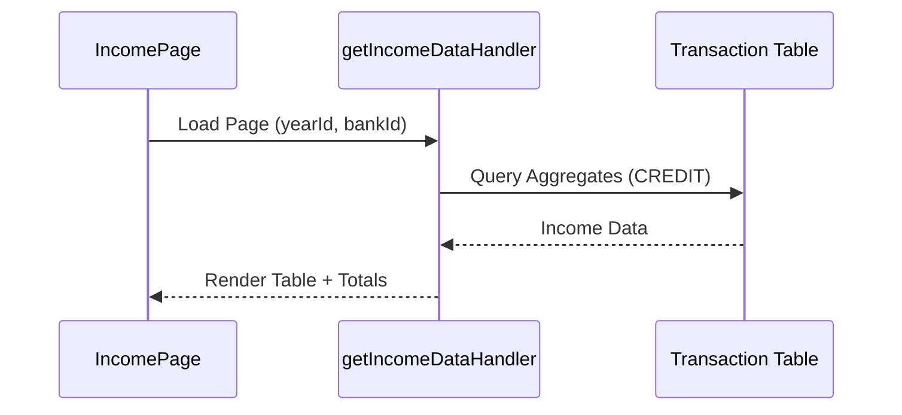

# Income Management — Low Level Design

## Service Contracts

| Action | Service Call |
|---|---|
| Read Income | `getIncomeDataHandler()` |
| Get Totals | `totalIncomeHandler()` |

## UX Flow: Income Management

