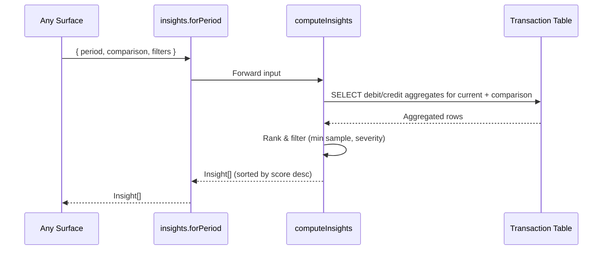

# Insights Engine — Low Level Design

## Service Contract

```ts
// src/server/services/insights/types.ts
export type InsightType =
  | 'top_expense_category'
  | 'top_mover_up'
  | 'top_mover_down'
  | 'anomaly_month'
  | 'savings_rate_change'
  | 'income_concentration';

export type Insight = {
  id: string;                   // stable signature for client-side dismissal
  type: InsightType;
  severity: 'info' | 'warn' | 'positive';
  headline: string;
  body: string;
  metric: { current: number; baseline?: number; unit: 'currency' | 'percent' };
  drillDownFilter?: DrillDownFilter;  // reuses existing AnalyticsDrillDownDrawer filter shape
  score: number;                // for ranking
};

export function computeInsights(input: {
  period: DateRange;
  comparison: DateRange | null;
  userId: string;
  bankAccountId?: string;
  includeCategoryIds?: string[];
  excludeCategoryIds?: string[];
}): Promise<Insight[]>;
```

## Data Flow



## Ranking

- Each insight receives a `score` in `[0, 1]`.
- Final list = top-N by score, deduped by `type` when configured, capped at the surface's display budget (Home=3, Analytics=5, Reports=5).
- `top_mover_*` require a minimum sample of 3 transactions in both current and comparison periods to avoid noise.
- `anomaly_month` requires ≥4 months of comparison history.

## tRPC Procedure

```ts
// src/server/trpc/router/insights.ts
export const insightsRouter = router({
  forPeriod: protectedProcedure
    .input(InsightsInput)
    .query(({ ctx, input }) => computeInsights({ ...input, userId: ctx.userId })),
});
```

## Test Plan

Fixture-based vitest under `src/server/services/insights/__tests__/`:

| Test | Asserts |
|---|---|
| `top_mover_up.fixture.ts` | Category with +50% MoM produces `top_mover_up` ranked #1 |
| `low_sample.fixture.ts` | Category with 1 transaction does NOT produce a mover insight |
| `anomaly.fixture.ts` | Month at +2σ produces `anomaly_month` |
| `savings_rate.fixture.ts` | 22%→14% savings rate produces `savings_rate_change` with severity `warn` |
| `income_concentration.fixture.ts` | 91% from one source produces `income_concentration` |
| `empty_period.fixture.ts` | Zero txns → empty `Insight[]` (no crashes) |

## Verification Gate

- `pnpm run type-check`
- `pnpm run lint`
- `pnpm spec:check`
- All insight unit tests pass.
- `pnpm run build` confirms tRPC types resolve client-side.
