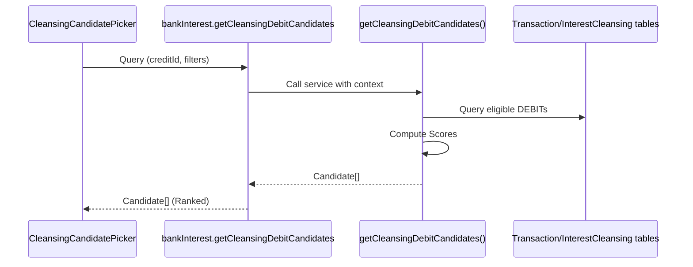

# Cleansing — DEBIT Candidate Picker (LLD)

## Service Signature
File: `src/server/services/bank-interest/interest-cleansing.service.ts`

```ts
export async function getCleansingDebitCandidates(params: {
  userId: string;
  creditId: string;
  bankAccountId?: string;
  search?: string;
  dateFrom?: string;
  dateTo?: string;
  limit?: number;
  minScore?: number;
}): Promise<Candidate[]>;
```

## Call Flow


## Scoring Algorithm
- Deterministic weighted sum of `amount` (0.6), `date` (0.1), `description` (0.2), `account` (0.1).
- `matchPercent` = `Math.round(100 * combinedNormalized)`.
