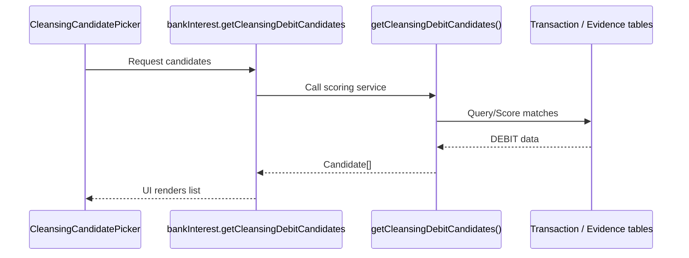

# Cleansing Donations — DEBIT Evidence Retrieval

## Purpose
Provides a fuzzy candidate picker API and UI that surface candidate DEBIT transactions for reviewer allocation.

## Architecture & Data Flow
Linking DEBIT evidence to interest credits uses purpose-specific evidence tables (e.g., `InterestCleansingEvidence`).

## Call Flow

