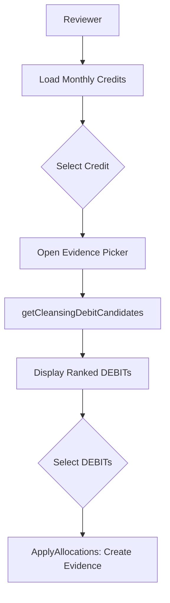

# Interest Cleansing — High-Level Design (HLD)

## Architecture

| Decision | Implementation |
| :--- | :--- |
| M:N Model | `InterestCleansing` (Credit) + `InterestCleansingEvidence` (Debit evidence) |
| Fuzzy Matching | `getCleansingDebitCandidates()` |
| Server-side Scoring | Deterministic weight-based scoring |

## Process Flow

