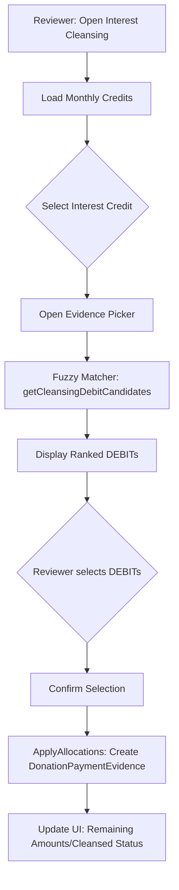

# Interest Cleansing — High-Level Design (HLD)

## Problem

Interest cleansing links bank "Credit Interest" to DEBIT donations. The system must support M:N linking with partial allocations while maintaining an immutable audit trail and supporting automated fuzzy-match suggestions for evidence retrieval.

## Solution

The system uses a credit-anchor + debit-evidence M:N model.

1. **Credit Anchor**: Bank INTEREST credit transaction.
2. **Evidence**: Donation DEBIT transaction (`DonationPaymentEvidence` join).
3. **Allocation**: Explicit amount linking.

## Architecture

| Decision | Rationale |
| :--- | :--- |
| M:N Model | Supports one credit cleansed by multiple donations, and one donation evidencing multiple credits. |
| Fuzzy Matching | Automates evidence retrieval using scoring on `amount`, `date`, `description`, and `account`. |
| Server-side Scoring | Deterministic, auditable, and performant (bounded candidate fetch). |
| Configuration | Uses configurable category name for rename-safe matching. |

## Process Flow

## Success Criteria

- Accurate M:N linking of Interest Credits to DEBIT Evidence.
- High-confidence automated suggestions (>60% acceptance).
- Clear, auditable evidence trail for every allocation.
- No orphaned transactions; no schema-breaking changes.
