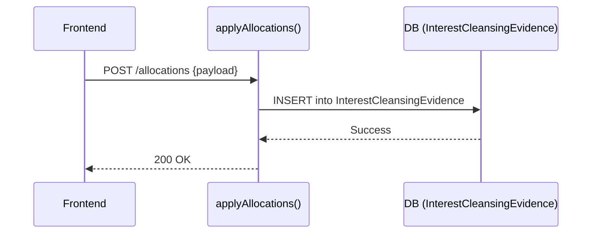

# Interest Cleansing — Low-Level Design (LLD)

## Service Mapping

| Action | Service Call |
|---|---|
| Create/Apply | `applyAllocations()` |
| Fuzzy Suggest | `suggestAllocations()` |

## UX Flows
### 1) Create Allocation

