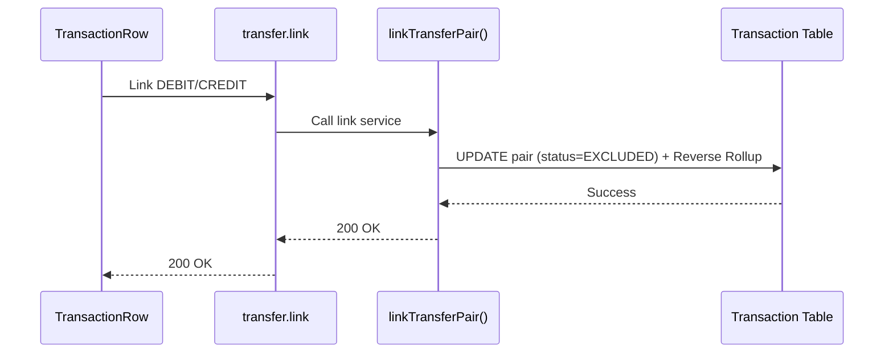

# Multi-Account Transfer Integrity — Low Level Design

## Service Contracts

| Action | Service Call |
|---|---|
| Link Pair | `linkTransferPair()` |
| Unlink Pair | `unlinkTransferPair()` |

## UX Flow: Reconcile Transfer

