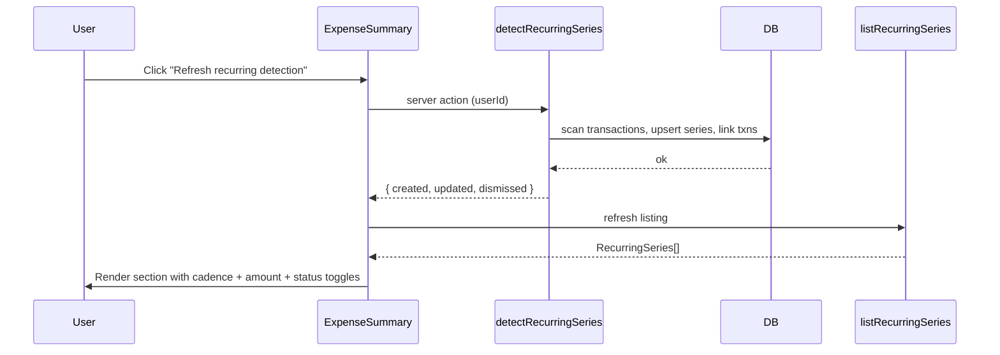

# Recurring & Subscriptions Detection — Low Level Design

## Schema (Prisma)

```prisma
model RecurringSeries {
  id              String   @id @default(cuid())
  userId          String
  payeeKey        String                    // normalised payee/merchant string
  cadence         RecurringCadence
  expectedAmount  Decimal  @db.Decimal(12, 2)
  tolerancePct    Decimal  @db.Decimal(5, 2) @default(10.00)
  confidence      Decimal  @db.Decimal(4, 3) // 0.000 – 1.000
  firstSeenAt     DateTime
  lastSeenAt      DateTime
  status          RecurringStatus @default(active)
  createdAt       DateTime @default(now())
  updatedAt       DateTime @updatedAt
  user            User     @relation(fields: [userId], references: [id], onDelete: Cascade)
  transactions    Transaction[]
  @@index([userId, status])
  @@index([userId, payeeKey])
}

enum RecurringCadence { weekly fortnightly monthly yearly }
enum RecurringStatus  { active inactive dismissed }

model Transaction {
  // …existing fields…
  recurringSeriesId String?
  recurringSeries   RecurringSeries? @relation(fields: [recurringSeriesId], references: [id], onDelete: SetNull)
  @@index([recurringSeriesId])
}
```

Migration: `pnpm prisma migrate dev --name add_recurring_series`. Commit schema + migration in the same change per `AGENTS.md`.

## Detection Algorithm

```
1. SELECT debit transactions for userId, last 18 months
2. group by (normalisePayee(description), amountBucket(amount, ±20%))
3. for each group with ≥ 3 occurrences:
     intervals = diff(sortedDates)
     cadence   = classifyCadence(intervals)         // {weekly|fortnightly|monthly|yearly} or null
     if cadence is null: continue
     amountStability = 1 - stdev(amounts) / mean(amounts)
     intervalStability = 1 - stdev(intervals) / mean(intervals)
     confidence = 0.5 * amountStability + 0.5 * intervalStability    // clamped [0,1]
     if confidence < 0.6: continue
     UPSERT RecurringSeries (payeeKey, cadence, expectedAmount=mean(amounts), confidence)
     UPDATE Transaction SET recurringSeriesId = series.id WHERE id IN (...)
```

`normalisePayee` strips order numbers / dates / trailing IDs; uses the same payee-key utility already present in transfer-match-rules (reuse, don't duplicate — confirm via `spec:check`).

## Service Contract

```ts
// src/server/services/recurring/detect-recurring.service.ts
export function detectRecurringSeries(input: {
  userId: string;
  lookbackMonths?: number;  // default 18
}): Promise<{ created: number; updated: number; dismissed: number }>;

export function listRecurringSeries(userId: string, status?: RecurringStatus): Promise<RecurringSeriesWithLastTxn[]>;
export function setSeriesStatus(seriesId: string, status: RecurringStatus): Promise<void>;
```

## Insight Integration

`computeInsights` (Phase 1) gains a new branch:

```ts
{
  type: 'new_recurring_candidate',
  severity: 'info',
  headline: 'New recurring charge detected: Spotify ($10.99/mo)',
  body: '3 monthly charges over the last 90 days. Confidence 87%.',
  drillDownFilter: { type: 'recurring_series', seriesId },
}
```

## UX Flow



## Verification Gate

- `pnpm run type-check`
- `pnpm run lint`
- `pnpm spec:check`
- `pnpm prisma migrate dev --name add_recurring_series` (user-supervised; never `db push`)
- Unit tests: weekly/fortnightly/monthly/yearly classifier; sparse data → no detection; amount drift > tolerance → no detection.
- Manual: import sample CSV with subscriptions → run detection → verify list + insight appears on Home.
