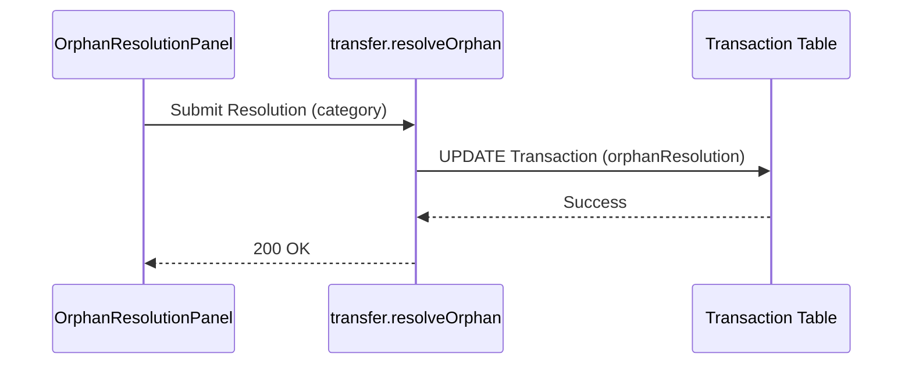

# Transfer Resolution UX — Low Level Design

## Service Contracts

| Action | Service Call |
|---|---|
| Auto-Detect | `runRetroactiveDetection()` |
| Resolve | `resolveOrphan()` |

## UX Flow: Orphan Resolution

