# Spec Remediation — Low Level Design

> Read `context.md` first for problem framing and the adopted ownership
> model. This document specifies the **how**: file contracts, schemas,
> invariants, and the chat-level execution loop.

## Architecture

```
┌──────────────────────────────────────────────────────────────────┐
│  Deterministic orchestrator (node scripts, no LLM, no API keys)  │
│                                                                  │
│  Owns: queue state, patch validation, atomic apply, rollback,   │
│  spec:check verification, progress reporting, audit trail.      │
└──────────────────────────────────────────────────────────────────┘
                       ↑                  ↓
       patches-batch-N/*.json     step{N}-tasks.json
                       ↓                  ↑
┌──────────────────────────────────────────────────────────────────┐
│  Chat-level agent (the only place LLM is invoked, via the       │
│  `task` tool with cheap-model workers):                          │
│                                                                  │
│  Owns: dispatch, batch sizing, user check-ins, stop_required    │
│  escalation. Holds no design state — re-derives everything from │
│  state.json + the LLD on every session.                          │
└──────────────────────────────────────────────────────────────────┘
                       ↑
              Human approval gate between batches
```

### Why this split

- **Most of the work is deterministic.** Reading the manifest, computing
  overlaps, grouping by likely target, validating JSON, applying patches,
  running `spec:check`, rolling back — all of these are pure functions
  over JSON. They belong in `node`, not in an LLM.
- **The irreducible LLM step is small.** *"Does file X implement the
  contract in feature Y's LLD?"* — a single decision with a structured
  output. Fits cheap models comfortably. Per
  `docs/harness-learnings.md` § Cheap-Model Friendliness, encoded
  protocols outperform open-ended reasoning at the Haiku tier.
- **The agent is a dispatcher, not a reasoner.** Per the same source,
  *"orchestrator ≠ reasoner."* The agent's job between batches is purely
  procedural: read state, fan out, collect, escalate. No design memory
  required — the LLD is the design memory.

## File layout

```
scripts/harness/spec-remediation/
├── discover.mjs                     # build step{N}-tasks.json from manifest
├── apply-patch.mjs                  # apply ONE patch + verify + rollback
├── apply-batch.mjs                  # apply patches-batch-N/*.json sequentially
├── report.mjs                       # pretty-print state.json + current overlaps
├── lib/
│   ├── manifest.mjs                 # read/write spec/index.json with locking
│   ├── overlaps.mjs                 # live overlap computation
│   ├── patch.mjs                    # patch validation + application primitives
│   └── prompts.mjs                  # render prompt templates with task data
├── prompts/
│   ├── step1-scope-down.md          # template
│   ├── step2-invariant-classify.md  # template
│   └── step3-overlap-decide.md      # template
├── schema/
│   ├── patch.schema.json            # JSON Schema for patch validation
│   └── task.schema.json             # JSON Schema for task validation
└── README.md                        # short pointer to this LLD
```

> **Folder convention** (defined in `spec/harness/hld.md`):
> `scripts/harness/<feature>/` mirrors `spec/harness/<feature>/` one-to-one.
> Cross-feature shared utilities live in `scripts/harness/_lib/` — created
> lazily only when ≥2 features actually need to share code (no preemptive
> DRY). All existing harness scripts now live under `scripts/harness/`
> (e.g. `scripts/harness/spec-manifest/spec-check.mjs`,
> `scripts/harness/spec-manifest/generate-spec-index.mjs`) — top-level
> `scripts/` is reserved for non-harness operational utilities.
>
> `lib/overlaps.mjs` here will eventually merge with the live-recompute
> logic now inlined in `scripts/harness/spec-manifest/spec-check.mjs`
> (Layer 1 fix from 2026-06-30). That merger is deferred until a second
> consumer needs it — keeping spec-check.mjs self-contained for now
> preserves its dependency-free, Tier-1-read-only character.

```
.harness/remediation/                # state — gitignored except state.json
├── state.json                       # canonical queue (committed)
├── step1-tasks.json                 # generated by discover.mjs (committed)
├── step2-tasks.json                 # generated by discover.mjs (committed)
├── step3-tasks.json                 # generated by discover.mjs (committed)
├── patches-batch-{N}/               # transient — sub-agent outputs (gitignored)
│   ├── task-{taskId}.json           # raw sub-agent JSON
│   └── task-{taskId}.applied.json   # post-apply audit row
└── log.md                           # newest-first run log (committed)
```

**Gitignore policy:** `patches-batch-*/` are working artifacts and may
contain sub-agent reasoning traces with no archival value. Everything else
in `.harness/remediation/` commits, so the queue survives session and
machine boundaries.

## State machine

```mermaid
stateDiagram-v2
    [*] --> discovered: discover.mjs
    discovered --> dispatched: agent reads tasks-N.json, picks batch
    dispatched --> patched: sub-agents return JSON to patches-batch-N/
    patched --> validated: apply-batch.mjs validates schema
    validated --> applied: apply-patch.mjs applies + runs spec:check
    applied --> verified: overlap count decreased monotonically
    verified --> [*]: state.json updated; user approves next batch

    validated --> rejected: schema invalid → task back to dispatched
    applied --> rolled_back: overlap regressed → patch reverted
    rolled_back --> escalated: stop_required = true in state.json
    escalated --> [*]: human resolves; state.json updated manually
```



## Schemas

### Task (one row of `step{N}-tasks.json`)

```jsonc
{
  "$schema": "../schema/task.schema.json",
  "tasks": [
    {
      "id": "step1-t001",                          // stable, kebab-numbered
      "step": 1,                                    // 1, 2, or 3
      "status": "pending",                          // pending | dispatched | applied | rejected | escalated
      "subject": "transactions.transactions",       // primary feature under review
      "target": "transactions.import-audit-trail",  // step 1 only — destination feature
      "files": [                                    // candidate file list
        "src/server/services/transactions/import-audit.service.ts",
        "src/components/transactions/ImportSessionHistory.tsx"
      ],
      "claimants": null,                            // step 3 only — list of claimant feature ids
      "promptTemplate": "step1-scope-down.md",
      "createdAt": "2026-06-30T18:00:00Z",
      "dispatchedAt": null,
      "appliedAt": null,
      "outcome": null,                              // populated when applied: { overlapBefore, overlapAfter, patchPath }
      "stopReason": null                            // populated if escalated
    }
  ]
}
```

### Patch (sub-agent output, one row of `patches-batch-N/task-{taskId}.json`)

```jsonc
{
  "$schema": "../schema/patch.schema.json",
  "taskId": "step1-t001",
  "step": 1,
  "feature": "transactions.transactions",          // feature being modified
  "ops": [
    {
      "op": "remove-files-from-owns",
      "bucket": "services",                         // routers | services | components | app | tests
      "files": ["src/server/services/transactions/import-audit.service.ts"]
    },
    {
      "op": "remove-files-from-owns",
      "bucket": "components",
      "files": [
        "src/components/transactions/ImportSessionHistory.tsx",
        "src/components/transactions/ImportValidationReview.tsx"
      ]
    }
  ],
  "rationale": "Single paragraph (~3 sentences) summarising DDD reconciliation.",
  "evidence": [
    {
      "file": "src/server/services/transactions/import-audit.service.ts",
      "lines": "30-34",
      "supports": "Implements getImportSessionDetails() per import-audit-trail/lld.md:L5-7"
    }
  ],
  "confidence": "high",                             // high | medium | low
  "stop_required": false,
  "ddd_trace": {                                    // one entry per file in ops[].files
    "src/server/services/transactions/import-audit.service.ts": {
      "claim": "...",
      "assumptions": [
        { "n": 1, "text": "...", "result": "✓", "evidence": "file:line" }
      ],
      "reconcile": "Proceed"
    }
  }
}
```

### Allowed `ops[].op` values

| op | Allowed in step | Effect on `spec/index.json` |
|---|---|---|
| `remove-files-from-owns` | 1, 3 | Remove listed files from `features[id].owns[bucket][]` |
| `add-files-to-owns` | 1 only | Append listed files to `features[id].owns[bucket][]` (must not duplicate) |
| `set-invariants` | 2 only | Replace `features[id].invariants[]` with given string array |
| `set-owns-confidence` | 1, 2 | Set `features[id].ownsConfidence` to allowed enum value |
| `set-status` | 2 only | Set `features[id].status` (e.g. to `"adr"` if step-2 reclassifies as ADR) |

All ops are idempotent: re-applying a patch must not change manifest
state. `apply-patch.mjs` enforces this via JSON deep-equality check.

## Script contracts

### `discover.mjs`

```
Usage: node scripts/harness/spec-remediation/discover.mjs --step <1|2|3> [--force]

Reads spec/index.json. For the requested step:
  - Step 1: enumerates files in transactions.transactions.owns that also
    appear in any transactions.* or cashflow.multi-account-transfer-integrity.*
    sub-feature's owns. Groups by target sub-feature.
  - Step 2: enumerates features whose lld.md is short (≤30 lines), whose
    name suggests cross-cutting (parity, integrity, audit), AND whose
    current owns[] overlaps multiple peer features. Heuristic, not
    authoritative — sub-agent confirms.
  - Step 3: enumerates files with >1 claimant after Steps 1+2 are applied.
    One task per file.

Writes .harness/remediation/step{N}-tasks.json. Refuses to overwrite
without --force if pending tasks exist (preserves resumability).

Exit codes: 0 success | 2 manifest malformed | 3 git unavailable
```

### `apply-patch.mjs`

```
Usage: node scripts/harness/spec-remediation/apply-patch.mjs --patch <path-to-patch.json>

Reads ONE patch JSON. Validates against patch.schema.json. Refuses if
any op affects a feature not declared in `feature`. Applies ops to
spec/index.json atomically (write-temp + rename). Runs `pnpm spec:check`.
If overlap count did not strictly decrease (or stayed the same when the
patch claimed to reduce overlaps), reverts the change and exits non-zero.

Writes outcome to <patch-path>.applied.json: { before, after, status }.
Appends to .harness/remediation/log.md.

NEVER calls git. NEVER commits. Manifest changes are uncommitted on
disk until the human commits.

Exit codes: 0 applied + verified | 1 rolled back | 2 schema invalid | 3 spec:check failed
```

### `apply-batch.mjs`

```
Usage: node scripts/harness/spec-remediation/apply-batch.mjs --batch <N>

Reads patches-batch-N/task-*.json in deterministic order (sorted by
taskId). Calls apply-patch.mjs on each. Stops on first rollback unless
--continue-on-error is supplied. Updates state.json per-task.

Designed for use from the chat agent after dispatching N sub-agents.
```

### `report.mjs`

```
Usage: node scripts/harness/spec-remediation/report.mjs [--step <N>]

Prints:
  - Current spec:check totals (live)
  - Per-step task queue: pending / dispatched / applied / escalated
  - Last 5 entries from log.md
  - Top 10 features by remaining overlap participation

Used at session start to orient and between batches to verify progress.
```

## Prompt template contract

Templates are markdown files with `{{double-brace}}` placeholders. The
orchestrator (chat agent) substitutes them when invoking a sub-agent via
the `task` tool.

### Required placeholders (every template)

| Placeholder | Source | Example |
|---|---|---|
| `{{TASK_ID}}` | `task.id` | `step1-t001` |
| `{{FEATURE_LLD}}` | path to subject feature's lld.md | `spec/transactions/transactions/lld.md` |
| `{{FILES_LIST}}` | bulletised `task.files` | (markdown list) |
| `{{ALLOWED_READS}}` | computed whitelist of file paths | (markdown list) |

### Step-specific placeholders

| Step | Adds | Used for |
|---|---|---|
| 1 | `{{TARGET_FEATURE_LLD}}` | scope-down target |
| 2 | (none beyond required) | invariant classification |
| 3 | `{{CLAIMANT_LLDS}}` (list of N lld.md paths) | overlap decision |

### Universal prompt prefix (in every template)

The `⚠️ CRITICAL CONSTRAINTS` block is mandatory and identical across
templates. It enforces the four invariants from `spec/harness/hld.md`:
read-only, allowed-reads-whitelist, JSON-only output, no manifest mutation.
Templates that omit or weaken this block are rejected by `discover.mjs`
during template-load.

## Invariants

These hold across every run; violations are bugs in this feature, not in
its inputs:

1. **Monotonic overlap reduction within a batch.** After each successful
   `apply-patch.mjs`, `spec:check` overlap count must be strictly less than
   before, OR the patch must explicitly target a non-overlap concern (e.g.
   step-2 invariant classification on a feature with no current overlaps).
   `apply-patch.mjs` enforces this and rolls back violations.
2. **Idempotency.** Re-applying any applied patch must be a no-op.
3. **No silent manifest mutation.** Every change to `spec/index.json` made
   by this feature has a corresponding `.applied.json` audit row and a
   `log.md` entry.
4. **No Tier 3 operations.** No `git push`, no `git commit`, no `prisma
   *`. The pipeline writes JSON to disk; the human commits.
5. **Sub-agent worker isolation.** Sub-agents may only read whitelisted
   files and may only output the patch JSON. The orchestrator validates
   both before passing the patch to `apply-patch.mjs`.
6. **Resumable from disk.** A fresh-context agent given only
   `.harness/remediation/state.json` + this LLD must be able to identify
   the next task to dispatch. No chat memory required.

## Decision rubric (when to use which step)

```
For each overlapping file:
  └─ Is one claimant a "root concept" feature (>20 owned files)?
     ├─ Yes → Step 1 (scope-down root → sub-feature)
     └─ No  → Is one claimant a cross-cutting concern
              (short lld, name contains "parity"/"integrity"/"audit",
              describes invariants > implementations)?
              ├─ Yes → Step 2 (move claims to invariants[])
              └─ No  → Step 3 (genuine boundary decision; DDD picks one)
```

Steps run in order — 1 first (mechanical, high-volume), 2 next (small,
clean), 3 last (lowest-confidence; benefits from a cleaner baseline).

## Chat-level execution loop

This is the procedure the agent follows between scripts. No design state
needed beyond `state.json` and this LLD:

```
1. On session start:
     node scripts/harness/spec-remediation/report.mjs
   → orientation. Shows pending tasks per step.

2. To run a batch:
   a. Read step{N}-tasks.json
   b. Pick K pending tasks (default K=3; ask user for K if not specified)
   c. For each task in parallel, dispatch a `task` sub-agent with:
        - Model: claude-haiku-4.5 (steps 1 & 2) or claude-sonnet-4.5 (step 3)
        - Prompt: rendered from prompts/{template} with task placeholders
        - Tools: read-only (view, grep, glob); never edit/create/powershell
   d. Each sub-agent returns ONE JSON object. Save raw to
        .harness/remediation/patches-batch-N/task-{id}.json
   e. Run:
        node scripts/harness/spec-remediation/apply-batch.mjs --batch N
   f. Run:
        node scripts/harness/spec-remediation/report.mjs
      → show before/after overlap; surface any stop_required: true tasks
   g. Ask user to approve next batch (or pause for stop_required review)

3. On stop_required:
     Read the patch's `rationale` and `ddd_trace` from
     patches-batch-N/task-{id}.json
     Surface to user via ask_user with the specific ambiguity
     User decides; agent applies the decision manually via a written patch
     placed in patches-batch-N/task-{id}.json (overriding the sub-agent's)
     Re-run apply-batch.mjs

4. On completion (no pending tasks across all steps):
     node scripts/harness/spec-remediation/report.mjs --final
     → produces summary suitable for commit message
     Ask user to commit (Tier 2 — explicit approval required)
```

## Cheap-model friendliness checklist

This feature must satisfy each of these constraints from
`docs/harness-learnings.md` § Cheap-Model Friendliness:

- [x] **Capsule-sized inputs.** Each sub-agent prompt is ≤2 KB rendered;
      template + task data + whitelisted file excerpts stays well under
      the 30 K context-rot threshold.
- [x] **Manifest-driven retrieval.** Sub-agents receive an explicit
      `ALLOWED_READS` list; never required to search.
- [x] **Explicit protocols.** DDD loop is embedded in every template; the
      sub-agent executes the protocol rather than inventing structure.
- [x] **Cite-or-flag gate.** Every `evidence[].file:line` must reference
      a whitelisted-and-read file; `apply-patch.mjs` validates citations.
- [x] **Orchestrator ≠ reasoner.** Chat-level agent runs scripts and
      dispatches; never produces ownership decisions itself.

## Open questions (resolve before code)

None blocking. These are minor and can be decided during build:

1. Should `report.mjs --final` include per-feature delta tables, or just
   totals? Lean toward totals for terseness; tables only on `--verbose`.
2. Should `step3-tasks.json` be regenerated after every step-1/step-2
   batch, or only after all of step 1+2 is complete? Lean toward the
   latter — fewer regenerations, clearer audit trail.
3. Should `apply-patch.mjs` accept `--dry-run`? Probably yes; trivially
   add it.

## Acceptance criteria

Feature is `done` when:

- [ ] `node scripts/harness/spec-remediation/discover.mjs --step 1` runs cleanly
      and produces a non-empty `step1-tasks.json`.
- [ ] One end-to-end batch (discover → dispatch 3 sub-agents → apply →
      verify) completes with overlap count strictly decreasing.
- [ ] `report.mjs` correctly shows the new state.
- [ ] State file `state.json` correctly persists across an intentional
      session restart (simulated by re-running `report.mjs` in a fresh
      shell).
- [ ] All five invariants above hold under a targeted test (manually
      verified for v1; automated test deferred).
- [ ] LLD updated if reality diverged during build.
