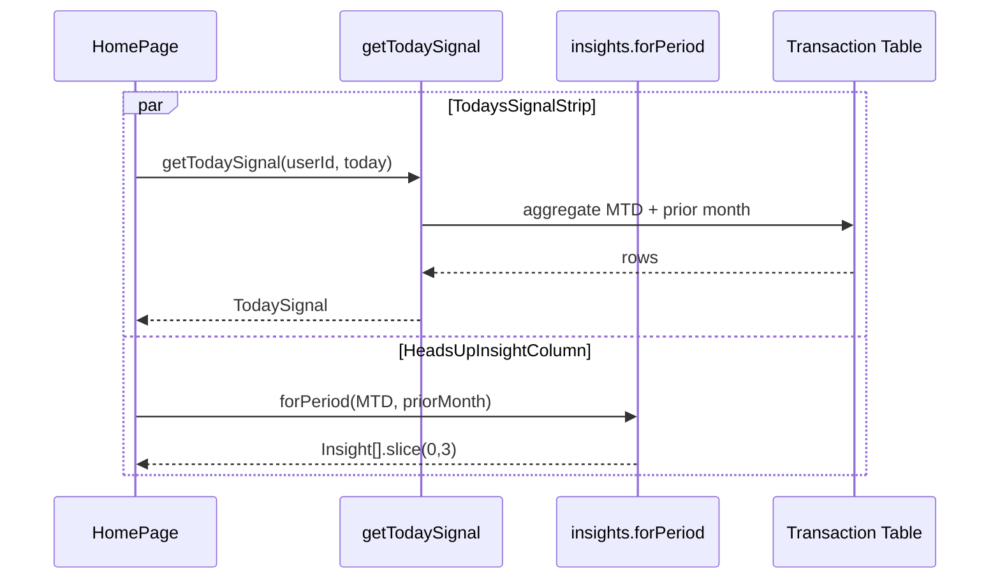

# Home Dashboard Narrative — Low Level Design

## Component Additions

```
src/app/(authorized)/home/_components/
  TodaysSignalStrip.tsx         (new — 3 KpiTiles)
  HeadsUpInsightColumn.tsx      (new — InsightCard list, dismissible)
  ProjectedMonthEnd.tsx         (new — naive current-pace projection helper)
```

## Service Helpers

```ts
// src/server/services/home/today-signal.service.ts
export type TodaySignal = {
  savingsRate: { current: number; prior: number; sparkline: number[] };
  topMover: {
    categoryName: string; current: number; prior: number; sparkline: number[];
    drillDownFilter: DrillDownFilter;
  } | null;
  projectedMonthEnd: { paceTotal: number; daysElapsed: number; daysInMonth: number };
};

export function getTodaySignal(userId: string, anchor: Date): Promise<TodaySignal>;
```

## Insight Consumption

- `HeadsUpInsightColumn` calls `insights.forPeriod({ period: currentMonth, comparison: priorMonth })` and takes the top 3.
- Each card has a `Dismiss` button that writes `dismissed:<insight.id>` into `sessionStorage`; the column filters on mount.
- Re-opening the tab clears dismissals (per-session is intentional — insights are time-sensitive and re-evaluating is cheap).

## Naive Projection (Phase 5 placeholder for Phase 7)

```
paceTotal = (monthToDateSpend / daysElapsed) * daysInMonth
```

Shown as "On pace for $X by month-end". Replaced by `forecastMonthEnd()` from Phase 7 when available.

## UX Flow



## Verification Gate

- `pnpm run type-check`
- `pnpm run lint`
- `pnpm spec:check`
- Unit test for `getTodaySignal` covering: empty month, single-day month, month with no prior data.
- Visual: hero strip renders on first visit; dismissed cards stay dismissed across nav within the session.
- Screenshot attached to handoff.
