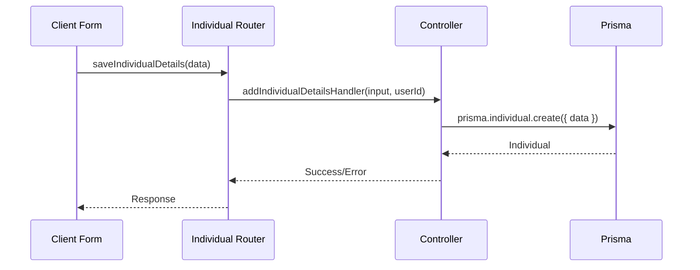

# Individual Contacts — Low-Level Design

## Phase Map

| Phase                        | Status      |
|------------------------------|-------------|
| CRUD Individual Contacts     | ✅ BUILT     |
| CRUD Relationship Types      | ✅ BUILT     |
| Form Validation (Zod)        | ✅ BUILT     |

## Functional Flow: Save Individual



## Key TypeScript Interfaces

```typescript
export interface Individual {
  id: string;
  name: string;
  firstName?: string;
  lastName?: string;
  relationshipId?: string;
  addressLine?: string;
  streetAddress?: string;
  suburb?: string;
  postcode?: number;
  state?: string;
  addressFormat?: string;
  userId: string;
  createdAt: string;
  updatedAt: string;
}

export interface RelationshipType {
  id: string;
  name: string;
  userId: string;
  createdAt: string;
  updatedAt: string;
}
```

## Key Zod Schemas (Production)

```typescript
export const createIndividualSchema = object({
  name: string().min(1).max(100).trim(),
  firstName: optional(string().max(50)),
  lastName: optional(string().max(50)),
  relationshipName: optional(string().max(150).trim()),
  addressFormat: optional(string().refine((val) => val === 'AU' || val === 'GLOBAL')).default('AU'),
  addressLine: optional(string().max(500)),
  streetAddress: optional(string().max(200)),
  suburb: optional(string().max(100)),
  postcode: optional(number().min(1000).max(9999)),
  state: optional(string().max(20)),
});
```

## TDD Test Cases

| Test                                 | Type    | Verifies                                      |
|--------------------------------------|---------|-----------------------------------------------|
| Create individual with valid data     | unit    | Individual is created, required fields present |
| Prevent duplicate name per user       | unit    | Unique constraint on (name, userId) enforced   |
| Add new relationship type            | unit    | User can add custom relationship label         |

## File Inventory

| File                                                        | Status   | Description                                 |
|-------------------------------------------------------------|----------|---------------------------------------------|
| src/app/(authorized)/relation/individual/page.tsx           | ✅ BUILT | Page shell for individual contacts          |
| src/app/(authorized)/relation/individual/form.tsx           | ✅ BUILT | Client form for add/edit individual         |
| src/app/(authorized)/relation/individual/layout.tsx         | ✅ BUILT | Layout for individual contacts route        |
| src/server/trpc/router/individual.ts                        | ✅ BUILT | tRPC router for individuals & relationships |
| src/server/schema/individual.schema.ts                      | ✅ BUILT | Zod validation schemas                      |
