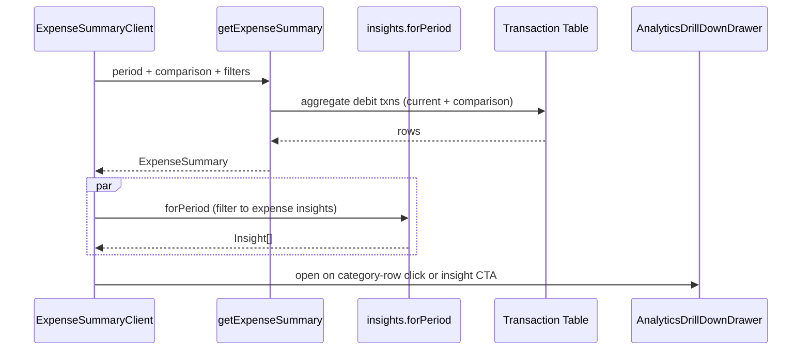

# Expense Summary Report — Low Level Design

## Service Contract

```ts
// src/server/services/reports/expense-summary.service.ts
export type ExpenseSummary = {
  totals: {
    total: number;
    avgMonthly: number;
    largestCategory: { name: string; amount: number };
    largestMonth: { label: string; amount: number };
  };
  comparison: { totals: ExpenseSummary['totals'] } | null;
  byGroup: { groupId: string; name: string; amount: number; percentage: number }[];
  monthly: {
    month: string;
    year: number;
    label: string;
    total: number;
    categories: {
      categoryId: string;
      name: string;
      amount: number;
      sparkline: number[];   // last 12 months for inline sparkline
      momDelta: number | null;
    }[];
  }[];
};

export function getExpenseSummary(input: {
  userId: string;
  period: DateRange;
  comparison: DateRange | null;
  bankAccountId?: string;
}): Promise<ExpenseSummary>;
```

## Page Structure

```
/reports/expense-summary/
  page.tsx                     server entry; resolves period defaults
  _components/
    ExpenseSummaryClient.tsx   client wrapper, filter bar, drill-down hook
    ExpenseKpiRow.tsx          4× <KpiTile>
    GroupRollupBars.tsx        stacked horizontal bars (reuses palette)
    MonthlyExpenseTable.tsx    expandable rows + sparkline + delta
    CategoryRow.tsx            single row primitive (sparkline + delta + drill)
    RecurringPlaceholder.tsx   replaced in Phase 6
    print.css                  @media print rules
```

## UX Flow



## CSV Export

`exportExpenseSummaryCsv(summary) → string` — one row per `(month, category)` with columns `Month`, `Category`, `Amount`, `MoM Δ`, `% of month`. Triggered by a "Download CSV" button; uses `Blob` + `URL.createObjectURL`.

## Verification Gate

- `pnpm run type-check`
- `pnpm run lint`
- `pnpm spec:check`
- Unit tests for `getExpenseSummary` over fixture data (empty period, single month, comparison present/absent).
- Manual print preview verifies columns fit on A4.
- Screenshot of report attached to handoff.
