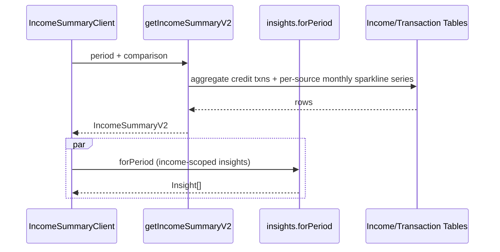

# Income Summary v2 — Low Level Design

## Service Extension

```ts
// src/server/services/income.service.ts (extended)
export type IncomeSummaryV2 = IncomeSummary & {
  stabilityScore: number;           // coefficient of variation (stdev / mean) of monthly totals
  monthlyTrend: { label: string; current: number; comparison?: number }[];
  sourceBreakdown: {
    sourceId: string; name: string; amount: number; percentage: number;
    sparkline: number[]; momDelta: number | null;
  }[];
};

export function getIncomeSummaryV2(input: {
  userId: string;
  period: DateRange;
  comparison: DateRange | null;
}): Promise<IncomeSummaryV2>;
```

## UI Changes

| Component | Change |
|---|---|
| `IncomeSummaryClient` | Swap `<Select>` for `<PeriodPicker>`; wire `usePeriodQueryState`; render `<InsightStrip>`; add donut + monthly trend chart |
| KPI cards | Replace with four `<KpiTile>`s, including new Income Stability tile |
| `MonthlySummaryTable` | Unchanged structurally; passes new data down |
| `SourceBreakdownRow` | Add sparkline + delta column on the right |
| `IncomeSourceDonut` (new) | Top-5 + Other; Chart.js doughnut |
| `IncomeMonthlyTrendChart` (new) | Line chart with optional ghost-line for comparison |

## Stability Score

```
stabilityScore = stdev(monthlyTotals) / mean(monthlyTotals)
```

- Render as a percentage with semantic colour: < 15% positive (stable), 15–35% neutral, > 35% warn (volatile).
- When < 3 months of data: render `—` with tooltip "Need at least 3 months for a stability score".

## UX Flow



## Verification Gate

- `pnpm run type-check`
- `pnpm run lint`
- `pnpm spec:check`
- Unit tests for `stabilityScore` (constant series → 0; high-variance → > 0.5).
- Visual: donut + monthly trend render and respect comparison toggle.
- Screenshot attached to handoff.
