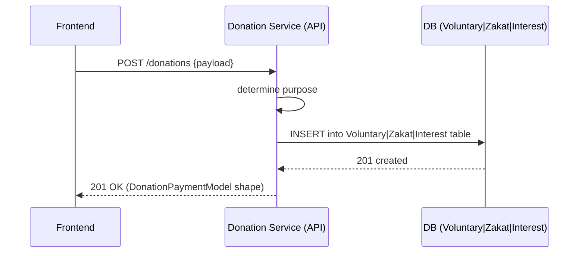
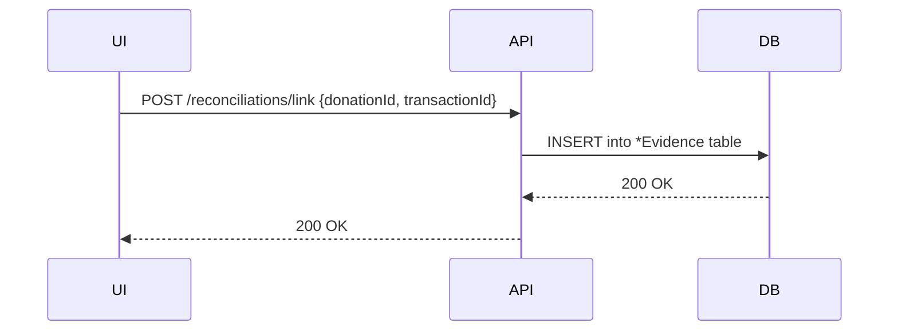
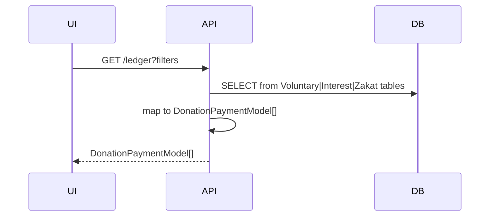
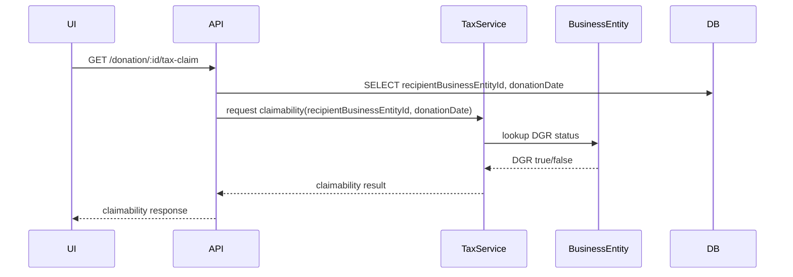

# Repurposing `DonationPayment` — Schema & Domain Architecture

## Decision (PO)

Adopted the **Split into Domain Models** approach: purpose-scoped models for `VoluntaryDonation`, `InterestCleansing`, and `ZakatPayment` to ensure strict domain boundaries and DB-level invariants, while maintaining service responsibilities and API stability for the frontend.

## Key constraints

- The frontend/UX remains unchanged. API shapes are stable.
- `DGR` status is deduced from `BusinessEntity` at request time (no historical snapshot stored on donation records).

## Schema (Actual)

```prisma

Look at @schema.prisma for

enum DonationPurpose { VOLUNTARY INTEREST_CLEANSING ZAKAT }

model VoluntaryDonation {...}

model InterestCleansing { ... }

model InterestCleansingEvidence { ... }

model ZakatPayment { ... }
```

## UX Flows

### 1) Create Donation



### 2) Reconciliation (Link Transaction)



### 3) Ledger Display



### 4) Tax Claim (derive DGR)


