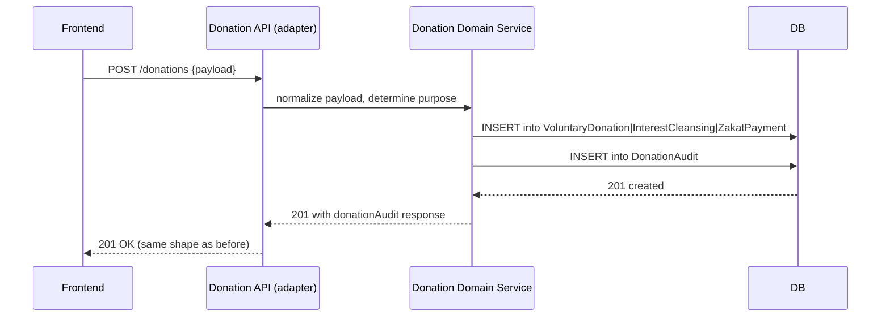
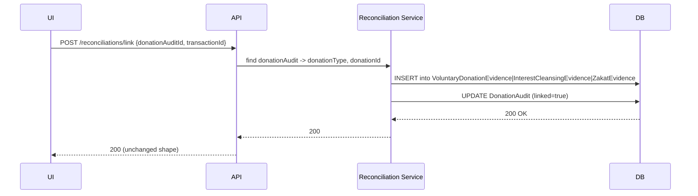
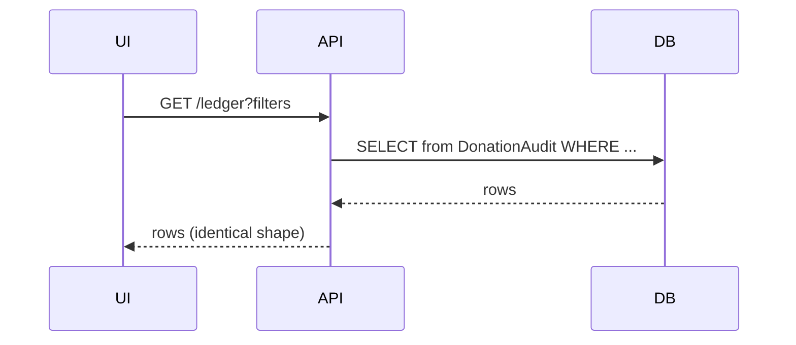
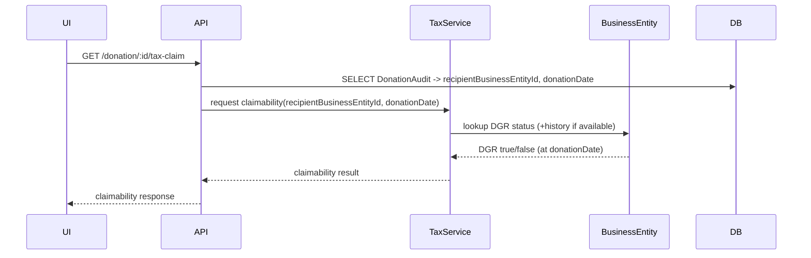
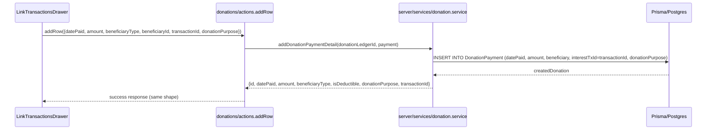
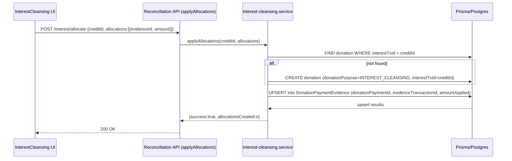

# Repurposing `DonationPayment` — Schema Design & Migration Plan

## Decision (PO)

- Adopt the **Split into Domain Models** approach: introduce purpose-scoped models for `VoluntaryDonation`, `InterestCleansing`, and `ZakatPayment` while providing a thin, read-only `DonationAudit`/`DonationIndex` for ledger/search compatibility with existing UI.

Rationale: this yields strict domain boundaries, DB-level invariants, and clearer service responsibilities while allowing the frontend to continue using the same UX with minimal adapter logic.

## Key constraints

- The frontend/UX must not change. Existing API shapes remain stable; server-side handlers will be refactored to write/read the new models directly (no adapter or anti-corruption layer unless absolutely required).
- `DGR` status is deduced from `BusinessEntity` (no separate `dgr` column on donation models). Per your direction, tax-claim calculations will be computed against the then-current DGR state on `BusinessEntity` at request time (no historical snapshot stored on donation records).

## High-level schema (Prisma-like snippets)

```prisma
enum DonationPurpose { VOLUNTARY INTEREST_CLEANSING ZAKAT }

model VoluntaryDonation {
  id        String   @id @default(uuid())
  amount    Decimal
  currency  String
  donorId   String?
  recipientBusinessEntityId String? // FK -> BusinessEntity
  createdAt DateTime @default(now())
  updatedAt DateTime @updatedAt
  // Evidence: many linked transactions
  VoluntaryDonationEvidence VoluntaryDonationEvidence[]
}

model VoluntaryDonationEvidence {
  id                    String  @id @default(uuid())
  voluntaryDonationId   String
  transactionId         String
  amountLinked          Decimal?
  createdAt             DateTime @default(now())
  @@unique([voluntaryDonationId, transactionId])
}

model InterestCleansing {
  id        String   @id @default(uuid())
  amount    Decimal
  currency  String
  sourceBusinessEntityId String? // philanthropic business
  createdAt DateTime @default(now())
  InterestCleansingEvidence InterestCleansingEvidence[]
}

model InterestCleansingEvidence {
  id                 String @id @default(uuid())
  interestCleansingId String
  transactionId      String
  amountLinked       Decimal?
  createdAt          DateTime @default(now())
  @@unique([interestCleansingId, transactionId])
}

model ZakatPayment {
  id           String @id @default(uuid())
  amount       Decimal
  currency     String
  payerId      String?
  recipientBusinessEntityId String?
  createdAt    DateTime @default(now())
  ZakatEvidence ZakatEvidence[]
}

model ZakatEvidence {
  id           String @id @default(uuid())
  zakatPaymentId String
  transactionId String
  amountLinked  Decimal?
  createdAt     DateTime @default(now())
  @@unique([zakatPaymentId, transactionId])
}

// Thin, denormalized view for ledger/search compatibility
 // We will not introduce a separate `DonationAudit` table: `Transaction` (the transaction ledger) remains the source of truth for ledger data and will continue to be queried by the UI. The server will continue to populate `DonationPayment` and `DonationPaymentEvidence` as the authoritative donation records.

 // Evidence tables remain purpose-aware via `DonationPayment.donationPurpose` and the existing `DonationPaymentEvidence` join table. This is the most economical path and preserves the current API shape.
```

Notes:

- `DonationAudit` is append-only and used for the ledger UI to avoid changing query patterns in the frontend. Backend services write to both the domain model and the audit record transactionally.
- Evidence tables are purpose-specific and remove the single generic `DonationPaymentEvidence` god-table.

## Migration strategy (staged)

1. Back up DB (mandatory). Create a read-only snapshot.
2. Add new models and evidence tables (Create migration). Do NOT drop old columns yet.
3. Backfill: migrate existing `DonationPayment` rows into one of the new tables according to existing `purpose` inference rules (if current data has no explicit purpose, run classification rules and log ambiguous rows for manual review).
4. For each migrated row, insert a `DonationAudit` record keeping the same public-facing fields so the ledger UI reads identical results.
5. Switch application code paths (feature-flagged): writes create domain model + audit entry, reads prefer domain models where appropriate but ledger endpoints continue to read `DonationAudit` to keep UI unchanged.
6. Run reconciliation tests comparing previous `DonationPayment` + `DonationPaymentEvidence` reports to new data; surface mismatches for manual review.
7. Once verified, remove old `DonationPaymentEvidence` and `DonationPayment.transactionId`/legacy fields in a final migration.

Rollback guidance:

- Each stage must be reversible until the final drop: keep the old tables/columns until validated.

## Frontend compatibility & server refactor guidance

- Goal: no UX changes. Existing API shapes must remain stable. Per your direction, do NOT introduce an adapter/anti-corruption layer. Instead, refactor existing server-side handlers and services to write to the new domain models and the `DonationAudit` concurrently. This keeps the public API identical while removing the legacy schema.

- Implementation notes:
  - Creation endpoints: refactor to persist into the purpose-specific table and insert a `DonationAudit` row in the same DB transaction.
  - Reconciliation endpoints: refactor to create purpose-specific evidence rows and update `DonationAudit` (linked flag) directly.
  - Read endpoints: keep ledger endpoints reading `DonationAudit` to preserve query patterns and response shape. Detail endpoints may join the domain table to provide expanded info when the frontend requests it.

Implications for code flow:

- Reconciliation and link/unlink flows that currently operate against `DonationPaymentEvidence` should be refactored to write to the corresponding purpose-specific evidence table. Legacy compatibility shims are allowable only as short-lived scripts used during migration verification (not as long-term runtime adapters).

## DGR / Tax Claim handling

- `DGR` will be deduced from `BusinessEntity`. As requested, tax-claim calculations will be computed against the then-current DGR state on `BusinessEntity` at the time of request. We will NOT store a snapshot of DGR on donations.

- Practical notes:
  - This simplifies the donation model but means tax outcomes can change if `BusinessEntity.dgrStatus` is updated retrospectively. Document this behaviour and, if needed later, add historical effective dates to `BusinessEntity`.
  - Ensure `DonationAudit` stores `recipientBusinessEntityId` and `donationDate` so the tax service can evaluate eligibility on demand.

## Mermaid diagrams (UX flows)

### 1) Create Donation (UI remains unchanged)



### 2) Reconcile Transaction -> Link Donation



### 3) Ledger display (read path unchanged)



### 4) Tax Claim (derive DGR)



## Code-grounded validation and frontend impact

I inspected the current server handlers and services to ensure the new schema supports existing UX without frontend changes. Key files reviewed:

- `src/app/(authorized)/cashflow/donations/actions.ts` (calls `addDonationPaymentDetail`)
- `src/server/services/donation.service.ts` (`addDonationPaymentDetail`, `getDonationPayments`, etc.)
- `src/app/(authorized)/cashflow/donations/_components/LinkTransactionsDrawer.tsx` (UI linking flow)
- `src/server/services/bank-interest/interest-cleansing.service.ts` (`applyAllocations`, `getYearlyCleansingData`)
- `src/app/(authorized)/cashflow/_utils/charity-tax.ts` (UI expects `donationPurpose` and `isDeductible` fields)

Conclusion: With a direct schema refactor (no adapter), the frontend requires no changes if the server continues to honor the same API shapes and field names. Specifically ensure:

- Read endpoints that return donation rows keep the same keys: `id`, `datePaid`, `amount`, `beneficiaryType`, `beneficiaryId` (as `businessId` or `individualId`), `isDeductible`, `donationPurpose`, and `transactionId` (or `interestTxId` equivalent). These are used by `charity-tax.ts` and UI components.
- Write endpoints invoked by `addRow` must still return the same response shape (see `addRow` in `donations/actions.ts`).

If these contracts are kept, the UX is unchanged. The server refactor will map new domain tables to these response shapes.

## Grounded Mermaid flows (based on current code)

### Donation Link — current implementation (refactor-safe)



Notes: In the refactor, `DonationPayment` will be replaced by `VoluntaryDonation` or `ZakatPayment` depending on `donationPurpose`. The server must still write the `transactionId` to the appropriate column (e.g., `interestTxId` semantics for interest credits) and return the same response keys.

### Interest Cleansing — allocation/linking (current `applyAllocations` flow)



Notes: In the refactor this maps to `InterestCleansing` + `InterestCleansingEvidence` tables; the logic is identical but table names change. The API response is unchanged.

## Linking details that must be preserved

- Evidence uniqueness: preserve the `@@unique([donationPaymentId, evidenceTransactionId])` constraint to avoid duplicate allocations.
- When deleting evidence, existing logic clears the `interestTxId` if no evidence remains; new model should preserve this behaviour (clear the `linkedCreditId` or equivalent).
- Queries that compute `isDeductible` rely on `business.isDgrRegistered` — keep that lookup in get/dto responses.

## Recommendation for migration code

- Implement migrations that add the new tables, backfill data (mapping old `donationPayment` rows into new per-purpose tables and copying evidence rows), update service code, run integration tests, then drop legacy columns/tables.

## Validators (how mermaids serve later)

- Each diagram corresponds to automated integration tests that assert the API shape and DB writes: e.g., create donation API must produce a `DonationAudit` row with identical fields as current implementation.

## Documentation delta

- Add this file to `spec/technical_debt/` and update `systemic-data-model-failure.md` with cross-reference and migration checklist.

## Next steps (for implementation)

1. Seek Principal Engineer approval for splitting approach and migration windows.
2. Draft concrete Prisma `schema.prisma` patch and staged migrations (with backfill SQL / JS) for review.
3. Implement adapter services and feature flag the write-path.
4. Add integration tests that assert no UX regressions (ledger read shape, reconciliation endpoints).

---

Prepared by: PO — next: draft migration scripts or produce the Prisma LLD. Request Principal Engineer review when ready.
