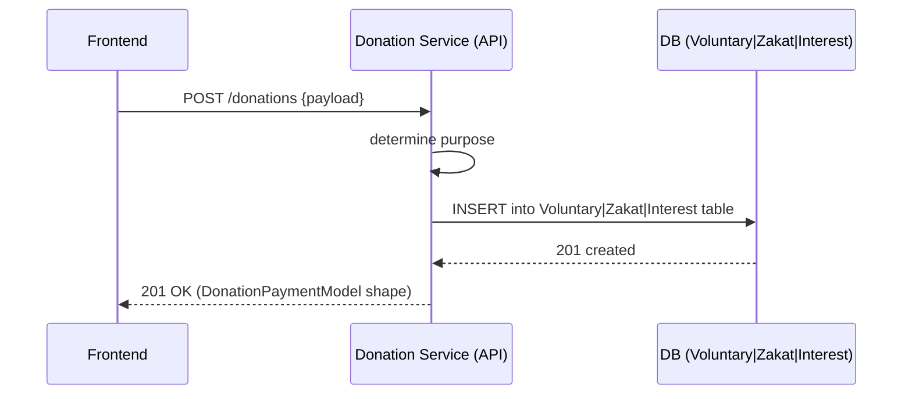
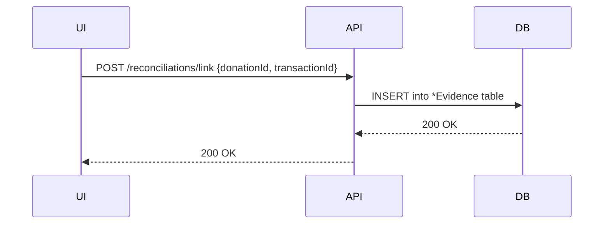
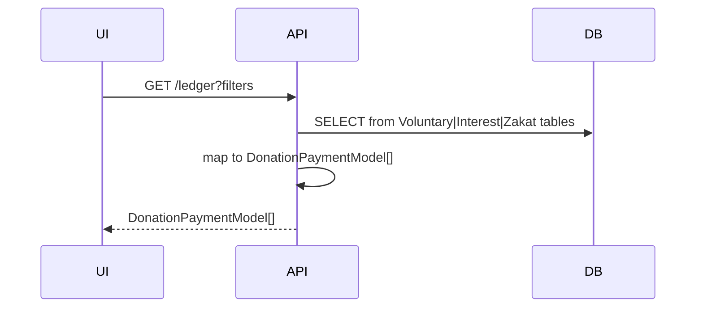
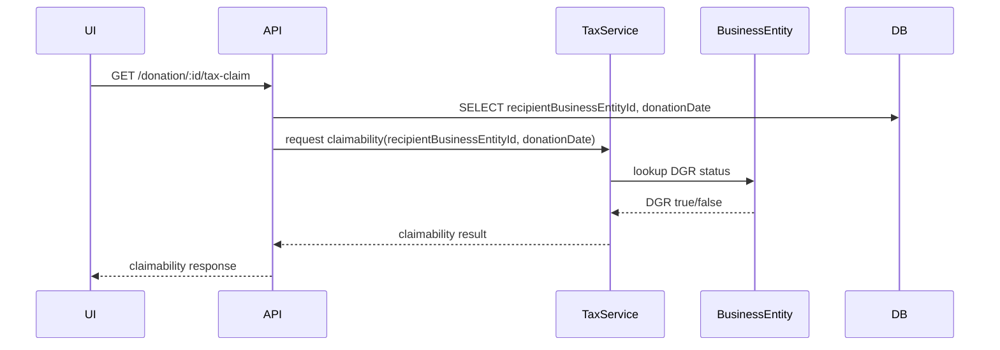

# Repurposing `DonationPayment` — Schema & Domain Architecture

## Decision (PO)

Adopted the **Split into Domain Models** approach: purpose-scoped models for `VoluntaryDonation`, `InterestCleansing`, and `ZakatPayment` to ensure strict domain boundaries and DB-level invariants, while maintaining service responsibilities and API stability for the frontend.

## Key constraints

- The frontend/UX remains unchanged. API shapes are stable.
- `DGR` status is deduced from `BusinessEntity` at request time (no historical snapshot stored on donation records).

## Schema (Actual)

```prisma
enum DonationPurpose { VOLUNTARY INTEREST_CLEANSING ZAKAT }

model VoluntaryDonation {
  id               String              @id @default(cuid())
  datePaid         DateTime
  amount           Decimal             @db.Decimal(19, 4)
  beneficiaryType  BeneficiaryEnumType
  businessId       String?
  individualId     String?
  donationLedgerId String
  purpose          DonationPurposeEnum @default(VOLUNTARY)
  transactionId    String?             @unique
  createdAt        DateTime            @default(now())
  updatedAt        DateTime            @updatedAt
  business         Business?           @relation(fields: [businessId], references: [id])
  donationLedger   DonationLedger      @relation(fields: [donationLedgerId], references: [id])
  individual       Individual?         @relation(fields: [individualId], references: [id])
  transaction      Transaction?        @relation(fields: [transactionId], references: [id])
}

model InterestCleansing {
  id               String                      @id @default(cuid())
  datePaid         DateTime
  amount           Decimal                     @db.Decimal(19, 4)
  sourceBusinessId String?
  donationLedgerId String
  creditTxId       String?                     @unique
  createdAt        DateTime                    @default(now())
  updatedAt        DateTime                    @updatedAt
  creditTx         Transaction?                @relation("InterestCredit", fields: [creditTxId], references: [id])
  donationLedger   DonationLedger              @relation(fields: [donationLedgerId], references: [id])
  sourceBusiness   Business?                   @relation(fields: [sourceBusinessId], references: [id])
  evidence         InterestCleansingEvidence[]
}

model InterestCleansingEvidence {
  id                  String            @id @default(cuid())
  interestCleansingId String
  transactionId       String
  amountApplied       Decimal?          @db.Decimal(12, 2)
  confidence          Float?            @default(0)
  createdAt           DateTime          @default(now())
  updatedAt           DateTime          @updatedAt
  interestCleansing   InterestCleansing @relation(fields: [interestCleansingId], references: [id], onDelete: Cascade)
  transaction         Transaction       @relation(fields: [transactionId], references: [id], onDelete: Cascade)

  @@unique([interestCleansingId, transactionId])
}

model ZakatPayment {
  id                String              @id @default(cuid())
  datePaid          DateTime
  amount            Decimal             @db.Decimal(19, 4)
  beneficiaryType   BeneficiaryEnumType
  businessId        String?
  individualId      String?
  zakatObligationId String
  transactionId     String?             @unique
  createdAt         DateTime            @default(now())
  updatedAt         DateTime            @updatedAt
  business          Business?           @relation(fields: [businessId], references: [id])
  individual        Individual?         @relation(fields: [individualId], references: [id])
  transaction       Transaction?        @relation(fields: [transactionId], references: [id])
  zakatObligation   ZakatObligation     @relation(fields: [zakatObligationId], references: [id])
}
```

## UX Flows

### 1) Create Donation



### 2) Reconciliation (Link Transaction)



### 3) Ledger Display



### 4) Tax Claim (derive DGR)


