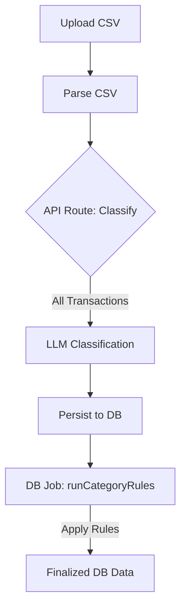
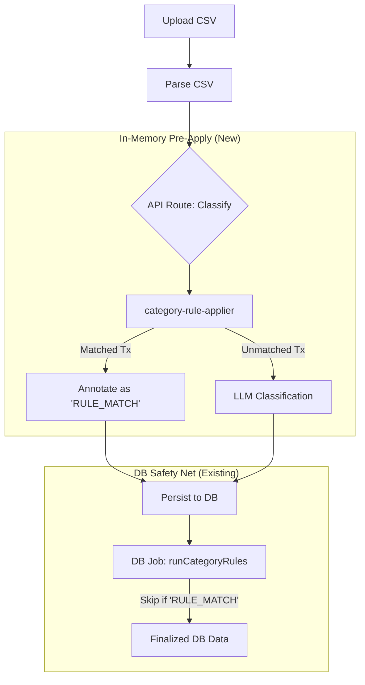

# High-Level Design: Pre-apply Category Rules Before LLM Classification

## Overview

This feature introduces an in-memory optimization step to the CSV transaction import flow. By pre-applying user-defined category rules to parsed transactions, we reduce LLM usage, improve classification speed, and provide deterministic results for known patterns before the LLM is invoked.

## Flow Comparison

### Current Flow (Before)

Transactions are uploaded, sent directly to LLM for classification, persisted, and only then run through rules in the database.

### New Flow (After)

We introduce an in-memory "filter" step to catch deterministic matches before incurring LLM costs.

## Role Distinction

| Step                        | Role          | Timing                      | Purpose                                                                        |
| :-------------------------- | :------------ | :-------------------------- | :----------------------------------------------------------------------------- |
| **`category-rule-applier`** | **Optimizer** | Before LLM call (In-memory) | Save money, reduce latency, provide immediate UI feedback.                     |
| **`runCategoryRules`**      | **Enforcer**  | Post-persistence (Database) | Ensure integrity. Handles new rules added after initial import/classification. |

## Phases

- Phase 1 (MVP): Perform in-memory pre-apply in `category-rule-applier`, stream `preMatch` to the client and allow review/override. Do not modify the core `transaction` schema in this phase — persistence of provenance is deferred.
- Phase 2 (Provenance persistence): Add DB-level persistence for provenance (`metadata.appliedRuleId` or explicit `appliedRuleId` column) and migrate `runCategoryRules` to respect persisted provenance. This phase requires a migration, update to `createTransactionRecord`, and coordinated tests.
