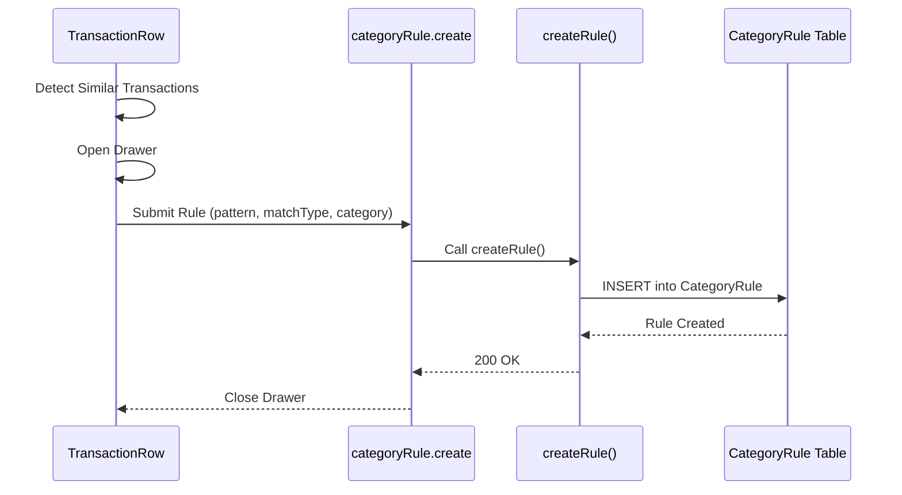
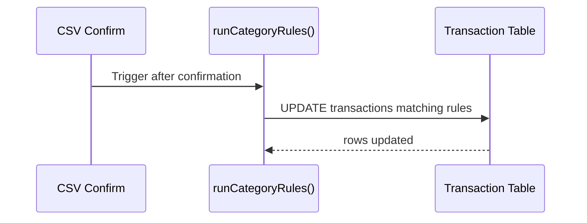

# Category Rules — Low Level Design

## Service Contracts

| Action | Service Call |
|---|---|
| Create | `createRule()` |
| List | `listRules()` |
| Toggle/Delete | `toggleRule()` / `deleteRule()` |
| Find Similar | `findSimilarTransactions()` |
| Run Rules | `runCategoryRules()` |
| Apply to Past | `applyRuleToPast()` |

## UX Flow: Create Rule

## UX Flow: Run Rules (Import)

