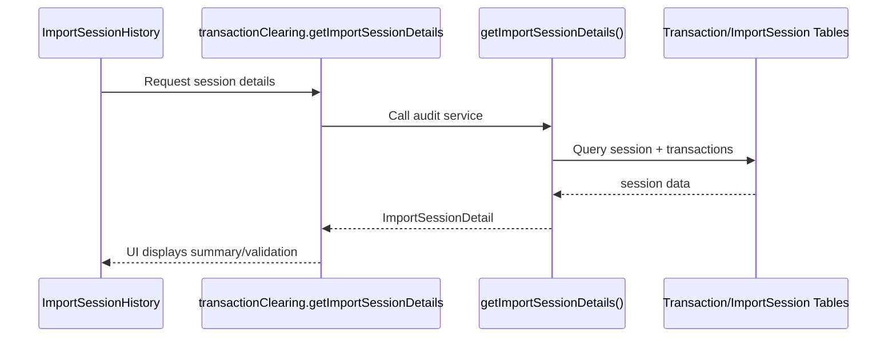

# Import Audit Trail — Low Level Design

## Service Contracts

| Action | Service Call |
|---|---|
| Get Session Details | `getImportSessionDetails()` |

## UX Flow: Import Audit

```mermaid
sequenceDiagram
  participant UI as ImportSessionHistory
  participant TRPC as transactionClearing.getImportSessionDetails
  participant Service as getImportSessionDetails()
  participant DB as Transaction/ImportSession Tables

  UI->>TRPC: Request session details
  TRPC->>Service: Call audit service
  Service->>DB: Query session + transactions
  DB-->>Service: session data
  Service-->>TRPC: ImportSessionDetail
  TRPC-->>UI: UI displays summary/validation
```
