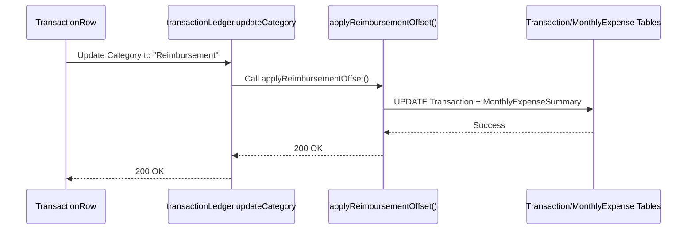

# Reimbursement Tracking — Low Level Design

## Service Contracts

| Action | Service Call |
|---|---|
| Apply Offset | `applyReimbursementOffset()` |
| Reverse Offset | `reverseReimbursementOffset()` |

## UX Flow: Assign Reimbursement

