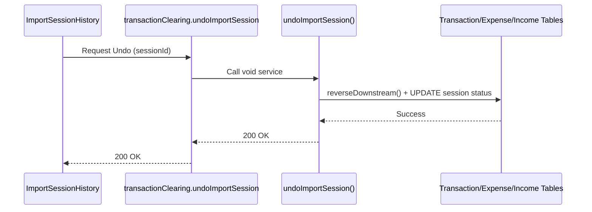

# Transaction Clearing — Low Level Design

## Service Contracts

| Action | Service Call |
|---|---|
| Void | `voidTransaction()` |
| Undo Session | `undoImportSession()` |

## UX Flow: Undo Import

