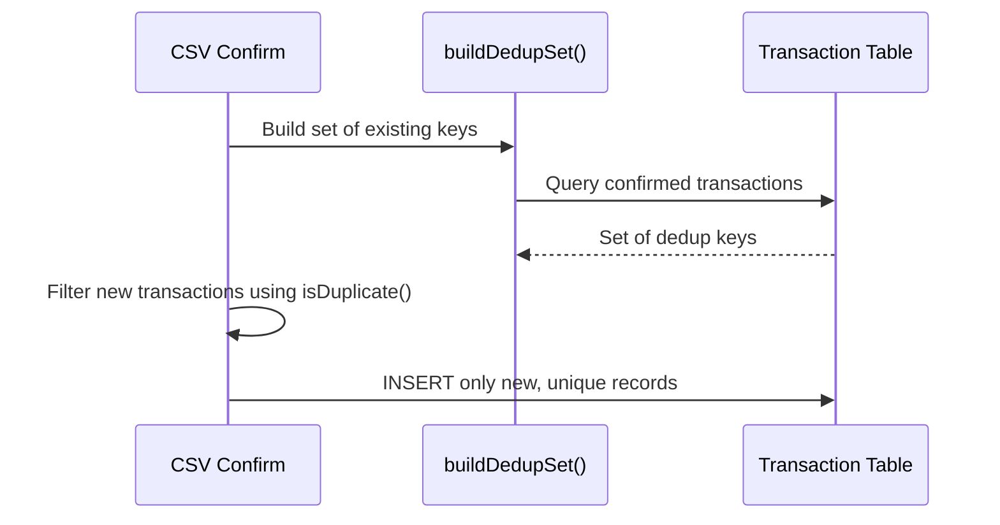

# Transaction Deduplication — Low Level Design

## Service Contracts

| Action | Service Call |
|---|---|
| Build Dedup Set | `buildDedupSet()` |
| Make Key | `makeDedupKey()` |

## UX Flow: Import Deduplication

