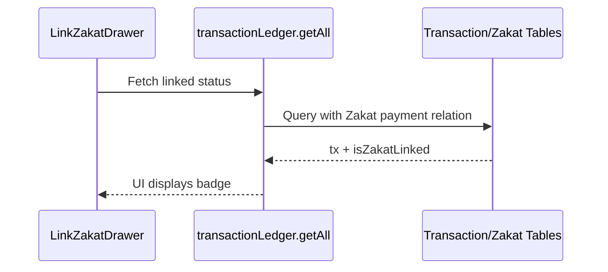

# Transaction Enrichment — Low Level Design

## Service Contracts

| Action | Service Call |
|---|---|
| Validate Date | `validateTransactionDate()` |
| Get Candidates | `getUnlinkedZakatTransactions()` |

## UX Flow: Linking

