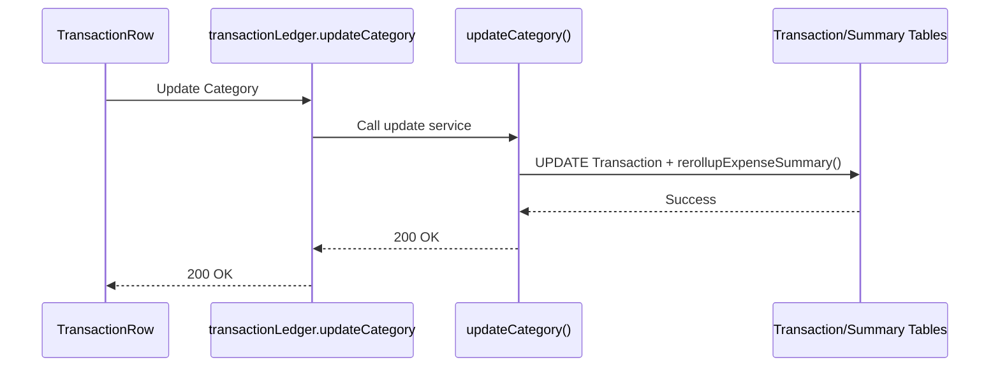

# Transaction Ledger — Low Level Design

## Service Contracts

| Action | Service Call |
|---|---|
| Get All | `getAll()` |
| Update Category | `updateCategory()` |

## UX Flow: Category Update

```mermaid
sequenceDiagram
  participant UI as TransactionRow
  participant TRPC as transactionLedger.updateCategory
  participant Ledger as updateCategory()
  participant DB as Transaction/Summary Tables

  UI->>TRPC: Update Category
  TRPC->>Ledger: Call update service
  Ledger->>DB: UPDATE Transaction + rerollupExpenseSummary()
  DB-->>Ledger: Success
  Ledger-->>TRPC: 200 OK
  TRPC-->>UI: 200 OK
```
