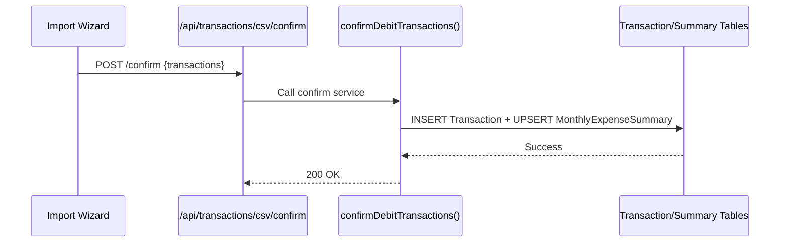

# Transactions (Import Pipeline) — Low Level Design

## Service Contracts

| Action | Service Call |
|---|---|
| Classify | `classifyTransactions()` |
| Confirm | `confirmDebitTransactions()` |

## UX Flow: CSV Import

