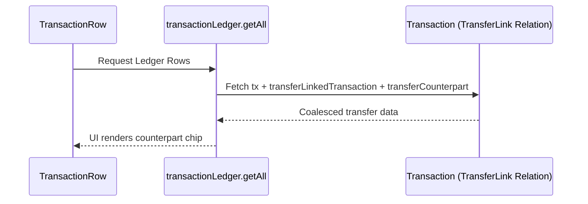

# Transfer Counterpart Display — Low Level Design

## Data Flow

```mermaid
sequenceDiagram
  participant UI as TransactionRow
  participant TRPC as transactionLedger.getAll
  participant DB as Transaction (TransferLink Relation)

  UI->>TRPC: Request Ledger Rows
  TRPC->>DB: Fetch tx + transferLinkedTransaction + transferCounterpart
  DB-->>TRPC: Coalesced transfer data
  TRPC-->>UI: UI renders counterpart chip
```
