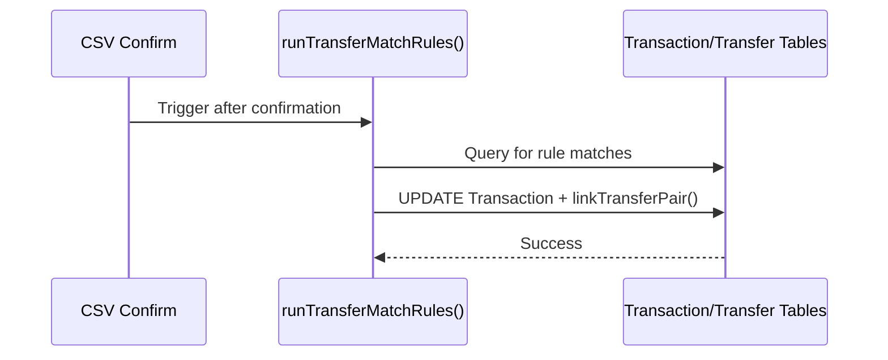

# Transfer Match Rules — Low Level Design

## Service Contracts

| Action | Service Call |
|---|---|
| Create Rule | `createRuleFromPair()` |
| Run Rules | `runTransferMatchRules()` |

## UX Flow: Auto-Match

