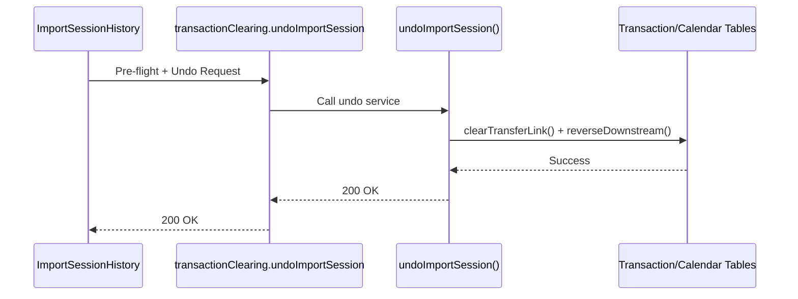

# Undo Safeguards — Low Level Design

## Service Contracts

| Action | Service Call |
|---|---|
| Clear Link | `clearTransferLink()` |
| Lock Year | `lock()` |

## UX Flow: Undo Import Safeguard

```mermaid
sequenceDiagram
  participant UI as ImportSessionHistory
  participant TRPC as transactionClearing.undoImportSession
  participant Service as undoImportSession()
  participant DB as Transaction/Calendar Tables

  UI->>TRPC: Pre-flight + Undo Request
  TRPC->>Service: Call undo service
  Service->>DB: clearTransferLink() + reverseDownstream()
  DB-->>Service: Success
  Service-->>TRPC: 200 OK
  TRPC-->>UI: 200 OK
```
